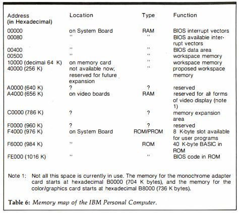
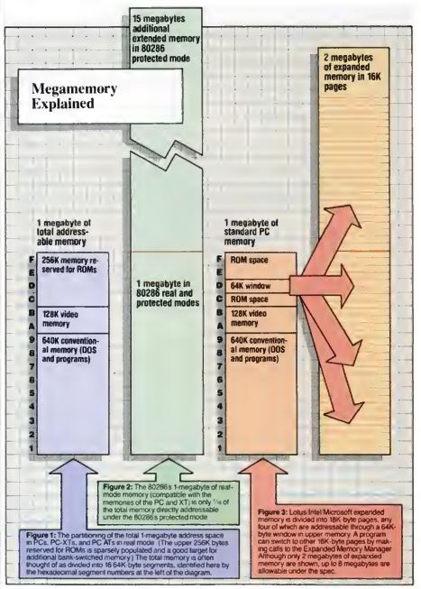

# 640 K 之墙

## 译注

本文译自 [The 640 K Barrier - The Digital Antiquarian :octicons-link-external-16:](https://www.filfre.net/2017/04/the-640-k-barrier/)（[存档:octicons-link-external-16:](https://web.archive.org/web/20170616220503/https://www.filfre.net/2017/04/the-640-k-barrier/)于互联网档案馆），原著时间 2017 年 4 月。个人翻译，如有水平不精之处，敬请理解。

回顾 IBM PC 的发展历史、MS-DOS 和英特尔的爱恨情仇，本篇文章将向你讲述一段精彩的历史故事。

<!-- more -->

## 正文

### 前言

> 在内存里住着一只恶魔。传言任何挑战它的人都一败涂地，他们的程序会锁死，他们的机器会崩溃，他们的数据会损毁。
>
> 这只恶魔住在十六进制内存地址 `A0000`，十进制的 `655,360`，超出此地，再无内存分配之机遇。它住在传言没有任何程序可以逾越的地方。人们称之为“640K 之墙”。
>
> *—— 不好意思，[《太空先锋》](https://www.youtube.com/watch?v=aQ-9lxbXqBg)[^1]……*

[初代 IBM PC](https://www.filfre.net/2012/05/the-ibm-pc-part-1) 使得美国公司首次对个人计算足以放心，但在它 1981 年 8 月发售以来的数十年间，热门的“技术行家”们便一直在过度宣扬其是“匆忙之中拼凑而生的折衷产品”。无论它的创造者们到底要面对怎样的时间和预算限制，在他们所作出的决策背后，是一套清晰的设计原则，而不是简简单单地使出“赶鸭子上架，越快越好，在其他小公司割走自己的蛋糕之前抢先一步推上市场”的战术。作为一种设计，IBM PC 倾向于可靠性、持久性和可扩展性，这些都是 IBM 在多年来和政府与企业打交道、为其最重要的数据处理需求提供大型解决方案总结而出的经验。若要领会 IBM 方法的智慧，只需要看看现在，在 Commodore Amiga 和 Apple 麦金塔（Macintosh）架构都早已成为历史之后（他们的用户还很喜欢嘲笑 IBM 的“枯燥无味的米黄色盒子”），我们的大多数笔记本和台式电脑（包括现代 Mac[^2]）之中的硬件都还可以追溯到一个在位于佛罗里达州博卡拉顿（Boca Raton）的 IBM 分支办公室的一个由一群不太适合商业但富有远见的人组成的小团队。

但是再有远见也不可能准确预测一切[^3]。尽管 IBM PC 强大如此，在一个领域，来自那些用着更炫的机器的人们的所有嘲笑都只能算是活该。这个致命弱点并不主要是因为第一台 IBM PC 的硬件，而更多是市场选择在其上运行的操作系统。它让开发人员和普通用户在接下来的二十年间挠腮撧耳，直到 2001 年微软发布 Windows XP 时，才随着 MS-DOS 神话的在主流计算中的终结而淡去。MS-DOS 这个在开发早期有着“快而脏”的绰号的操作系统，可能是计算机史上“总开发小时数/总使用小时数（在数百万计的电脑上）”对比最鲜明的软件。而 640K 之墙，这个所有用户殚精竭虑对抗的恶魔，只是美国企业采纳 MS-DOS 这个半成品作为标准的后果里更显眼的那个罢了。今天，我们将解读这个问题：MS-DOS 的内存管理。我们还会分析五花八门的解决方案——多少都有点丑陋和不完美。

### 8088 和 1 MiB

初代 IBM PC 使用了一颗 Intel 8088 处理器，8086（一个更老的芯片）的低配、低成本版本（IBM 选择 8088 而不是 8086 的决定将对这台和未来机器的[扩展总线](https://www.filfre.net/2016/08/ibms-new-flavor)造成重大影响，但对我们今天所说的事来说，两颗芯片的差距无关紧要）。虽然在大多数时候作为一颗 16 位芯片，8088 其实有 20 位的寻址空间，意味着它可以寻址最大 1 MiB 的内存，让我们想想为什么会有这样的限制。

内存（memory），无论是在大脑里的还是电脑里的，若无法跟踪其位置以便后续读取，则毫无用处。于是电脑中的内存以字节（byte）为单位索引，每一个字节都有它独一无二的地址。这些从 0 到处理器寻址空间最大限值的地址，使得电脑可以知道在哪里放了什么东西。20 bits 能最大表示的数字是 1,048,575，而 1,048,575 个字节即为 1 MiB，也就是 8088 的 20 位寻址总线能处理的最大内存量。对创造初代 IBM PC 的工程师，这并不是什么大不了的事。的确，在他们 1981 年发布这台机器时，1 MiB 有多大，怎么强调都不算过分。毕竟在当年，所谓“顶级”的 Apple II 也只有 48 KiB 的内存，还有很多机器甚至只有不到 16 KiB.

除了用于运行应用程序的通用内存池以外，处理器还需要处理其他类型的内存。还有在制造阶段烧写进芯片的 ROM 内存——只读内存（Read-Only Memory），其中包含了为了使电脑能正常启动的所需底层代码，对初代 IBM PC 来说，还有一套 BASIC 编程语言的基本实现（因为罕有使用，在后续机型里逐渐被剔除）。还有一些从通用内存池中划分出来给特殊用途的内存区域，比如提供给显示卡以保持初代 IBM PC 屏幕显示的整整 128 Ki 的地址。所有这些特殊类型的内存都必须能由 CPU 访问，必须有自己的唯一地址来实现功能，因而也必须从通用内存池中的可用地址空间中减去。

IBM 工程师在划分通用内存池和特殊用途地址空间时十分大方。为了实现可扩展性和持久性的目标，他们给一些从未想到过的用途保留了大块的“特殊”内存。总的来说，他们为实际或者潜在的特殊用途保留了 3/8 的高位内存，剩下的 5/8——640 KiB，留给通用内存池。随着时间的推移，最开始的 640 KiB 内存成为了“常规内存”，而剩下的 384 KiB（其中一部分是 ROM 而不是 RAM）则成为了“高位内存”。在 IBM PC 亮相时，IBM 官方发布的内存映射表大概是这样：

值得注意的是，当阅读像这样的内存映射表时，需要意识到逻辑地址的存在并不意味着在真实机器上就一定有内存连接到了这个地址。例如，初代 IBM PC 可以买到最小只有 16 KiB 常规内存的型号。即便是顶级机器也就只有 256 KiB，使常规内存的大部分区域都是空的。类似的，早期的显示卡也只用了高位内存所提供的 128 KiB 的地址空间里的 32 KiB 或者 64 KiB. 于是 640 K 之墙在早期只能算一个理论上的限制，很少有早期用户或开发人员注意到了这一点。

### 80286 和 16 MiB

然而好景不长，伴随着 IBM 的成果（和[一众复制品](https://www.filfre.net/2014/10/send-in-the-clones)）成为美国商业的新标准，越来越多的高级应用程序出现了，对内存和算力提出了越来越高的要求。仅仅到 1984 年，640 K 之墙便从理论性的变成了实实在在的限制，而客户也开始要求 IBM 对此给出一个交代。作为回应，IBM 同年发布了 PC/AT，使用了号称具有 24 位寻址空间、可处理 16 MiB 内存的英特尔 80286 处理器。为了解锁这些潜在的额外内存空间，IBM 决定遵循常识，延伸内存映射表超过止于 1 MiB 的特殊用途高位内存区域，把所有超过 1 MiB 的内存地址都作为一个适用于通用用途的“扩充内存”（extended memory）池。

问题解决？呃……不完全是，否则这篇文章就要短得多了。由于更多是软件层面而不是硬件层面的问题，事实证明，所有这些潜在的扩充内存对绝大多数买了 PC/AT 的人来说用处不大。要理解为什么会变成这样，我们需要关注新处理器和人们仍在其上运行的老操作系统的死亡之拥。

80286 远不只是 8086/8088 处理器的更快版本。在运行 MS-DOS 的 IBM PC 占领商用计算之前，英特尔就在开发这款芯片了，而他们并没有为了保持和这种配置兼容的目的而放弃设计帮他们引领计算新方向的下一代芯片。英特尔认为微型计算机正处于几十年前大型机构机器所处的阶段，即将突破计算机科学家 Brian L. Stuart 所描述的“一之三角”：**一个用户**在**一台电脑**上一次运行**一个程序**。最起码，英特尔认为这个三角的第三个点必须倒下，大家都意识到了多任务，即同时运行多个程序并在其间自由切换，在完成复杂任务时，比起费时费力地关闭和开启一个个应用程序，效率实在是高太多了。但遗憾的是对 MS-DOS 来说，添加多任务支持会让它的复杂度上升到一个惊为天人的程度。

操作系统当然是值得终身学习的复杂课题。但我们也可以把它们的复杂度分解为几个基本功能：

1. 为用户提供使用电脑管理程序和文件的界面、
2. 管理电脑上运行的任务并在其之中分配资源、
3. 作为电脑底层硬件和应用程序之间的缓冲或桥梁。

这些就是我们希望如今的操作系统最起码能做到的事情。但对于困在“一之三角”的电脑来说，第二和第三个功能没什么必要：

1. 只有一个程序能同时运行，所以资源管理的顾虑就不存在了；
2. 没有程序同时运行导致冲突的顾虑，裸金属（bare-metal）计算，即直接对硬件进行操纵，而非通过交织的操作系统调用传递请求，常被认为不仅是可接受的，而且是预期的方法。

本着这种精神，MS-DOS 仅仅为开发人员提供了 27 个函数调用，其中绝大多数都只涉及磁盘和文件管理。（跟现代的 Windows 或者 OS X API 对比一下吧，程序员同行们！）至于其他事情，裸金属直接拿着大锤开砸都是可以的。

甚至到这个时候，我们都没法开始讨论当引入多任务到等式中时，要求操作系统在此过程中完全接受上述三点核心功能，会带来的复杂问题。光是我们本次将深入研究的内存管理问题就变得足够复杂了。和其它程序共享同一台机器的程序再也不能在内存里自由来往，随处堆放数据了，因为这么做存在覆写其它正在系统上运行的应用程序的代码或数据的风险。反之，操作系统必须要求每个应用程序正式请求它们想使用的内存，且必须设法阻止程序对未授权的内存区域进行修改，无论是出于 bug 还是恶意。

可能也不必。在个人电脑史上开创了多任务先河的 Commodore Amiga 没怎么解决问题的后半部分，反倒踢到一边去了。一个应用程序应当向 Amiga 的操作系统请求任何其需要的内存，操作系统随之返回指向具有其所请求大小的内存区块的指针，并单方面信任应用程序不写到界线以外的内存。然而除了开发人员的技术和良心以外，没有任何东西能阻止此类未授权的内存访问发生。换句话说，Amiga 上的每个应用程序，都可以写入机器内存的任何地址，无论是否得到了正确分配。显示内存、可用内存、其它应用程序的数据、其它应用程序的代码，都是图谋不轨的应用程序的盘中餐。这种未经授权的内存访问几乎总是以系统的完全崩溃作为结局。一名无恶意的开发人员，当然会想让自己的程序作为良好公民，永远不会故意写到没有正确分配的内存，但这种类型的 bug 是出了名的写出来容易修起来难。在 Amiga 上，一个这样的错误不仅会让出错的程序崩溃，还会连带上整个操作系统。虽然 Amiga 作为第一个支持多任务处理的个人电脑的意义值得尊重，但显然这不是实现多任务处理的理想方式。

### 保护模式和实模式

更可靠的方法是额外增加一步，要跟踪、还要**保护**分配给应用程序的内存。内存保护通常是使用[**虚拟**内存](https://www.filfre.net/2012/01/zil-and-the-z-machine)实现的：当一个应用程序请求内存，它得到的并不是系统内存池里的真实地址，而是一个虚拟地址，可以在每次程序访问其数据时映射到真实地址。于是每个程序都被有效的置于沙箱中，与其它应用程序隔开，仅能读写其自己的数据。只有操作系统底层对内存池有完整的全局访问。

仅仅在软件层面实现此类内存保护，对 20 世纪 80 年代的系统工程师来说的资源的消耗是完全无法承受的，这也侧面证明了为何 Amiga 没有此类实现。于是英特尔决定用硬件来助软件一臂之力。他们在 80286 中内置了一个内存管理单元，它可以自动地将虚拟内存地址转换为实际内存地址，反之亦然，使这个持续的过程对即使是操作系统来说也相对透明。

尽管如此，操作系统必须能了解到这个功能的存在，也实际上为了在有内存保护电路的 CPU 上运行，必须采取非常不同的编写方式。英特尔意识到了为这款芯片编写此类操作系统是需要一定时间的事情，也意识到了与此同时对 8086/8088 芯片的兼容性是一件好事，于是他们在 80286 中内置了两个可用的运行模式：

- 在“保护模式”（他们希望最终能广泛使用）下，芯片的完整潜能都能得到释放，包括内存保护和最高寻址 16 MiB 的能力。
- 在“实模式”下，80286 会像一颗增强版的 8086/8088，没有内存保护功能，且依然存在 1 MiB 的寻址空间上限。

考虑到在早期，至少这款新芯片需要在不了解其完整能力的老操作系统上运行，英特尔决定让 80286 在启动时默认运行在实模式。如果操作系统**确切**了解 80286 且想充分发挥其完整潜能，可以在启动时将其切换至保护模式再开始运行。

### 80286 和文物

但在 80286 和操作系统的世界线收束的地方，英特尔对自己未来芯片的雄心壮志出了差错。早期 80286 的绝大多数都被用在了 IBM PC/AT 和其仿品上，而这之中的绝大多数都运行着 MS-DOS，微软古老的“快而脏”的操作系统，它对 80286 的完整能力一无所知。更糟糕的是，若要让它了解这些能力，就得完全重写，继而破坏与所有现存 MS-DOS 软件的兼容性。而 MS-DOS 最开始如此流行的原因，不是丰富的功能，不是友好的用户界面，也不是艺术上的吸引力，而偏偏就是那一大批商用软件。要让用户跳到一个假想的、没有软件在之上运行的操作系统，就和让开发者为一个没有用户的操作系统开发应用程序一样难。这就是一个先有鸡还是先有蛋的问题，并且谁都看不到短期内出现任何一个的可能性。

很快，IBM 每个月都能卖出数千台 PC/AT，而仿品厂商甚至后来自己还卖出了更多的 80286 机器。然而这些机器中至少 95% 都在待机中浪费自己的绝大多数潜能，多亏了这堪比三星堆文物的 MS-DOS。对于所有这些用户，过去的 640 K 之墙还是一如既往的高，他们可以在机器里塞满扩充内存，然而却完全没有办法**使用**。当然，本应被 80286 变成现实的多任务处理，对 MS-DOS 来说依然是一个未知领域，就像一台 GPS 模块对福特 T 型车[^4] 来说。IBM 为抱怨现状的客户提供的唯一出路就是换一个别的操作系统。的确，对 PC/AT 和其它基于 80286 的机器来说，还有一些 MS-DOS 的替代品，包括好几种研究机构最喜欢的 Unix 的变种（甚至还有一种来自微软），还有一些新发明比如数字研究公司（Digital Research）的并行 DOS，它努力地实现了一部分 MS-DOS 兼容性，但结果喜忧参半。然而，要充分利用 MS-DOS 庞大的软件库，唯一万无一失的方法就是运行真正的 MS-DOS。（不止一种方法了！）MS-DOS，这就是大多数用着配备 80286 的机器的人们最终落得用的东西。

与此同时，为 MS-DOS 开发软件而使得 MS-DOS 成为大部分用户仅剩选择的人们日复一日地感受到被 640 K 之墙挤得越来越疼了。终于，创造了统治美国公司的史上最成功软件 Lotus 1-2-3 表格的 Lotus 公司坐不住了，决定靠他们的影响力做点什么。他们说服了英特尔，与其一同设计出一个在不抛弃 MS-DOS 的情况下逾越 640 K 之墙的方案。他们最终提出来的方案是个不堪入目的烂补丁[^5]——也适用于描述其他所有突破 640 K 之墙的企图。

### 骑着文物过大河

看着初代 IBM PC 设计师留下的松散的高位内存区域，Lotus 和英特尔意识到应该在任何现有的机器上都能寻找到一块未使用的连续 64 Ki 地址区块。于是他们决定使这个区块成为通往安装在这台机器别处潜在的数兆内存的大门。通过软硬件协作，他们实现了一套称为“bank 切换”的机制。这块 64 Ki 的高位内存地址区块被分割为四个 16 Ki 的小块，每个都作为一个透镜，指向 1 MiB 以上内存里的 16 Ki 个分块。当处理器访问这些高位内存里的地址，其实际访问的数据则位于这些透镜指向的地方。这四个透镜都可以自由移动，虽然是以轮转的方式，但给了用户访问他们实际安装的内存的能力。使用这种机制解锁的内存被称为“扩展内存”（expanded memory）。很不幸的是在接下来的年头里，因为它太像“扩充内存”（extended memory）了，这两个词创造了无数的混淆和歧义。从这里开始，我们用通用缩写“EMS”代表它。

所有这些额外的内存也不是免费的：应用程序需要经过修改来检测 EMS 内存是否存在并予以利用，传统内存和 EMS 内存之间仍然有开发人员需要时刻注意的区别。同样地，不断移动这些透镜带来的开销使得 EMS 内存显著慢于传统内存。但往好处看，EMS 内存在 MS-DOS 下即可使用，只需要在启动期间添加一个额外的驱动程序即可。并且，由于移动透镜的硬件机制完全不依赖处理器，它甚至可以在没有配备新型 80286 的机器上运行。

!!! note

    此图展示了 20 世纪 80 年代中期 PC 上不同的内存类型，在蓝色区域，我们可以看到 IBM PC 原本的 1 MiB 内存映射表。在绿色区域，我们可以看到额外配备有扩充内存的机器。而在橙色区域我们可以看到配备有额外扩展内存的机器。

在 1985 年 5 月 COMDEX 展会上，该套机制正式亮相，在此不久之前，Lotus 和英特尔说服了第三个关键合作伙伴加入：微软。“这是垃圾！这是烂补丁啊！”比尔·盖茨如是说道，“但我们会做的”。在 Lotus、英特尔和微软三大巨头的影响力下，EMS 成为了跨越 640 K 之墙最切合实际的方法。即使它既不完美也很杂乱，软件开发商还是一拥而上为自己实际利用得到的程序添加 EMS 内存支持，而硬件生产商则急忙着向市场输送更多 EMS 内存板。EMS 可能很丑陋，但它已成标准，又不是不能用。

### 又不是不能用

EMS 倒是飞黄腾达了，但扩充内存（extended memory）也不是就此寿终正寝了。一些硬件制造商（最出名的明显是 IBM）并不想沾上 EMS 的丑陋。软件开发商则继续探索装配有扩充内存的机器的极限，但仍然试图在 MS-DOS 的限制中访问到扩充内存。如果只在需要操纵扩充内存中的数据时，短暂地将 80286 切换到保护模式，然后再切换回实模式会怎么样？看起来蛮有道理的，但英特尔从来没料到过会有人想这样在运行时切换模式，也就没在 80286 中提供任何从保护模式切换**回**实模式的方法。于是，扩充内存的倡导者们提出了一套比实现 EMS 还要更丑陋的烂补丁方案。他们发现可以通过重置 80286，就像用户重启了电脑一样，以此把它切换回实模式。随后 80286 会再次运行自检（实不相瞒，浪费了宝贵的几毫秒时间），然后再从停下的地方重新开始。这就像微软的 [Gordon Letwin](https://www.filfre.net/2011/07/microsoft-adventure) 的名句说的一样，“就为了换个档，还得把车子的火给熄了”。这套操作乱得**惊人**，低效得糟糕透顶，但它能用。鉴于它低效的本性，这套机制主要用于实现存储于在扩充内存里的虚拟磁盘，不会受到应用程序数据空间持续访问的影响。

### 80386 和 XMS

在 1986 年，英特尔最新最强的芯片，32 位的 80386，首次亮相于康柏（Compaq）Deskpro 386 电脑之中，而不是一台 IBM 机器。标志着商业计算的影响力中心缓慢而稳定地从 IBM 移动到了微软和使用微软的操作系统的仿品厂商。在开发这款新芯片时，英特尔也用了些时间来观察 80286 是怎样被使用的，同时也面对了现实，MS-DOS 的宿命大概是“新三年，旧三年，缝缝补补又三年”，而不是被什么更好的东西整个换掉。于是除了其它更明显的改进以外，他们对 80386 做出了一个简单而又关键的修改：80386 不仅可以在保护模式使用 32 位地址空间寻址难以置信的 4 GiB 内存大小，更重要的是，可以在不需要被反复重置的情况下，于运行时在保护模式和实模式之间来回切换。

80386 把开发人员从严重的低效中解放出来，敞开了在 MS-DOS 中合理使用扩充内存的大门。在 1988 年，EMS 三巨头之 Lotus、英特尔和微软再一次坐在一起，这次带上了一个仿品厂商：AST，但偏偏没有 IBM，又一次，仿佛在暗示什么。他们一起编制了一套在 80386 和更新处理器上使用扩充内存的标准方法，大体上和我之前描述 80286 时的机制一致，但多了一个简单的命令把 80386 切换回实模式，取代之前的处理器重置。他们称之为扩充内存规范（eXtended Memory Specification），使用此方法访问的内存随后被统称为“XMS”内存。和在 EMS 之下一样，XMS 模式下只需要一个新的设备驱动程序载入到 MS-DOS 即可。普通的实模式应用程序可以调用这个驱动来访问扩充内存，驱动程序会完成需要的工作，如切换到保护模式、将数据块从扩充内存复制到常规内存，反之亦然，然后在将控制权交还程序前将处理器切换回实模式。这还是不大优雅，还是有点低效，还是丝毫没有按照英特尔工程师意图的方式使用最新处理器的功能，真正的多任务还是黄粱一梦。换句话说，对更炫机器如麦金塔（Macintosh）和 Amiga 的机主们来说，还是有很多嘲讽的理由。在大多数场景下，使用 XMS 内存的效率实际上还不如使用 EMS 内存。XMS 内存的主要优势是可以让应用程序访问和 EMS 的四个 16 Ki 区块允许的相比远远更大块的非常规内存。对于任何程序来说，选择 EMS 还是 XMS，最终都需要看它们各自的优缺点谁更适合实际使用场景。

XMS 的到来，和 EMS 的应用，意味着 MS-DOS 现在有两个竞争的内存管理方案。买家现在不仅得搞清楚自己到底是否有足够的额外内存来支持应用程序运行，还需要弄明白自己是否买到了**正确类型**的额外内存。为了给用户提供便利，硬件制造商开始给销售可配置为 EMS 或 XMS 内存的内存板，取决于你现在运行的应用程序到底需要什么类型的内存。

### 海绵里的水

在内存管理方面，向其它计算平台缓慢爬行靠拢的下一阶段是“DOS 扩充器”的开发，一种允许应用程序直接运行在保护模式，从而获得对扩充内存的直接访问的软件。使得应用程序无需将其请求传递给低效率的设备驱动程序。一个使用 DOS 扩充器开发的应用程序只需在和操作系统沟通时将处理器切换回实模式。DOS 扩充器的开发得益于微软的努力，他们想把 Windows，在看似所有商业计算都在 MS-DOS 的基础上运行的情况下，变成命令行界面的可行替代品和 Macintosh 的可行挑战者。不过这个故事最好还是留给未来的文章吧，到时候我们会详细分析 Windows 本身。事实上，我本次所讲述的故事已经让我们顺利地进入了本博客的电脑游戏历史时代。

在这个时代，此前主要用于商用领域的 MS-DOS 机器逐渐进入家庭，时常用于游玩新一代的游戏，它们充分利用了最新系统配备的 VGA 图形、声卡和鼠标。没那么好的事情是，所有想玩这些新游戏的人都得面对只能以不完美的形式回避的 640 K 之墙。正如我们所见，EMS 和 XMS 都在访问非常规内存时增添了些性能开销。但游戏偏偏是所有应用程序中对性能最敏感的，这使得 640 KiB 的高速常规内存寸土寸金。

在 MS-DOS 统治游戏市场的头些年头，开发人员为了解决和访问 640 KiB 以上的内存有关的问题，干脆选择了根本不使用 640 KiB 以上的内存。但这个解决方案既不能满足开发者们对自己的游戏日渐增长的野心，也不能达到游戏玩家们对游戏愈发提高的期待。

未来的第一个预兆是 1990 年 9 月 Origin Systems 发布的《银河飞将》（Wing Commander）。在当年它既声名远扬，又令人害怕，担心它会不会将现代的高端硬件压榨到极致。但即使是《银河飞将》也没有严格要求超过 640 KiB 的内存，但在存在的情况下，用它来让玩家的游戏体验更加舒适。但它使用额外内存的方式不太灵活：必须使用 EMS 内存，而不是 XMS 内存，为后续游戏开创了先河。未来的游戏玩家也因此被迫对两种标准的区别和如何配置自己的机器使用何种标准了如指掌。《银河飞将》开创的另一个先河是在“安装指南”中包括了一个必须阅读才能让游戏正常运行的“内存使用”的段落。在未来，这种段落只会越来越长和晦涩难懂，长期受苦受难的玩家在这上面使出的注意力比任何和“如何玩他们购买的游戏”有关的内容要多得多。

!!! note

    在 Accolade 对《Leisure Suit Larry》的尴尬抄袭《Les Manley in: Lost in LA》中，主角在一些成熟的伴侣旁解释 EMS 和 XMS 内存。讽刺的是任何想在 MS-DOS 机器上玩最新游戏的人真的知道这些东西，或者至少有知道这些的朋友。

于是一个近十年的历史阶段开始了，让属于过去时光的人们在回想起时不仅充满了懊恼，还常常夹杂着些许怀旧的情结。在这段时间里，玩家们总是要花数小时时间折腾 MS-DOS 的 `config.sys` 和 `autoexec.bat` 文件、来回更换各种各样的第三方工具，祈祷着能在常规内存里挤出游戏 X 需要的最后几 KiB 内存，手段层出不穷。

在开发 Windows 的过程中，微软发现多亏了其高龄，MS-DOS 内核其实足够小到可以塞进 1 MiB 内存以外的第一个 64 KiB 区域。而多亏了 80286 和后续处理器的一个未公开的设计缺陷，这块内存可以在实模式被当作常规内存来访问。玩家们随后学到了在他们的配置文件里填一行 `DOS=HIGH` 来在宝贵的常规内存中释放出一块区域。类似的，在绝大多数机器 384 KiB 的高位内存空间里散落着足够的空闲空间来存放 DOS 的设备驱动程序，而无需放在常规内存里。于是 `DOS=HIGH` 随后变成了 `DOS=HIGH,UMB`，第二个参数告诉电脑使用所谓的“高位内存块”（upper-memory blocks），进而又省下若干 KiB 的空间。

这些只能算是起始点，是最基本的技巧。可以说，事情从此以后变得更加复杂了，演变成错综复杂的精细调整，从在常规内存中节省几 KiB 变成仅仅几个字节，但对于实现梦想、在 1993 年运行需要从 640 KiB 中拿走 604 KiB 的游戏的这件事上，它们都同等的重要。尽管当时的机器一般都有若干 MiB 的内存，机主们却不得不为了区区几字节和操作系统之间来回拉扯，难免让人觉得滑稽好笑。每个新的游戏都试着挑战极限，索取越来越多的常规内存。那些性格开朗或者有技术头脑的人就把每次费劲让买回来的游戏跑起来这件事情当做一个游戏来看。其他人则捶胸顿足，无数次后悔自己为什么没有早早买拿来就能玩的游戏主机。唯一使这一切值得的就是当你终于把一切调整得服服帖帖，看到了标题画面，听到了主题音乐时，那种如释重负、自豪和满足感夹杂在一起的感觉（前提是你在折磨之中配置好了自己的声卡）。这就是 MS-DOS 玩家的生活。

### 盖茨的名言

和多年来一直被此折磨的人们一样，我们很难把 640 K 之墙抛在脑后。但在此之前，我们需要聊聊比尔·盖茨据称在 1981 年的展会上所作出的说法：“640 K 给谁用都够了（640 K ought to be enough for anybody）”。这句话被当作计算机行业的传说，在数年间被人们口口相传。似乎很符合大家对比尔·盖茨的刻板印象：一个没有想象力的肮脏骗子，和史蒂夫·乔布斯的真诚而有远见的形象相对（但不必多说，事实上远比此更加复杂）。但对持有刻板印象的人来说，很遗憾的是这个传说就和别的传说一样，可以几乎确定没有发生过。第一，盖茨本人就坚决否认自己说过这样的话；第二，《耶鲁名言大全（The Yale Book of Quotations）》的作者 Fred Shapiro 在 2008 年为了这句话深入寻找了可信来源，以至于在《纽约时报》公开求援，希望找到这样消息来源的人能联系他。上百人这么做了，但没有一个能拿出他想要找到的证据，于是他更加确信这句话“真实性存疑”。喏，就是这样。你可以因为这个破烂不堪的操作系统，作为我这篇文章描述的各种各样问题的根源，随便责备比尔·盖茨，但别认为他足够笨到说出**那句话**。盖茨在 2008 年说：“没有任何计算机从业者会说出‘一定量的内存就能满足所有时间的需要了’这句话”。所有怀疑这句话的人只需要看看 IBM PC 的历史就够了。

[^1]: 是的，这大概是我写过的最中二的话了。
[^2]: 译注：本文著于 2017 年 4 月，当时的 Mac 电脑均基于 x86 架构。基于 ARM 架构的 Mac 电脑于 2020 年发布。
[^3]: 译注：原文为“*no visionary has 20-20 vision*”，20-20 指在视力测试中能看清 20 英尺以外的物体。
[^4]: 译注：此车辆生产于 1908 至 1927 年，被视作历史上第一款普通家庭能负担的汽车。
[^5]: 译注：原文为“*one mother of an ugly kludge*”，确实难听。
