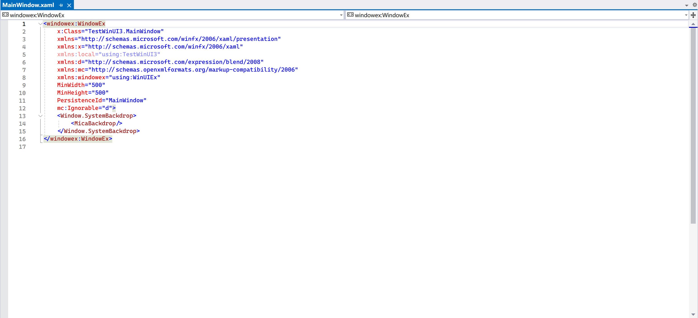
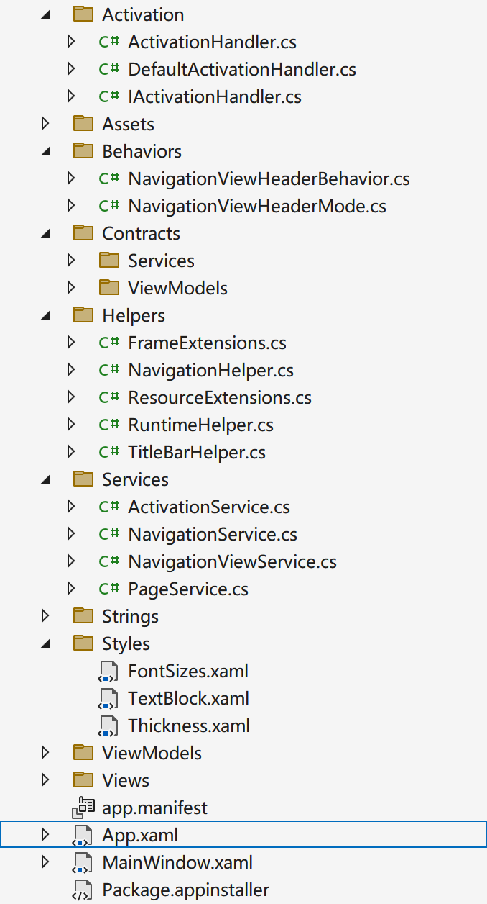
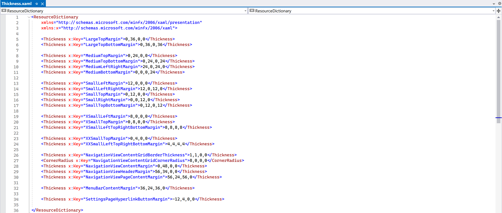
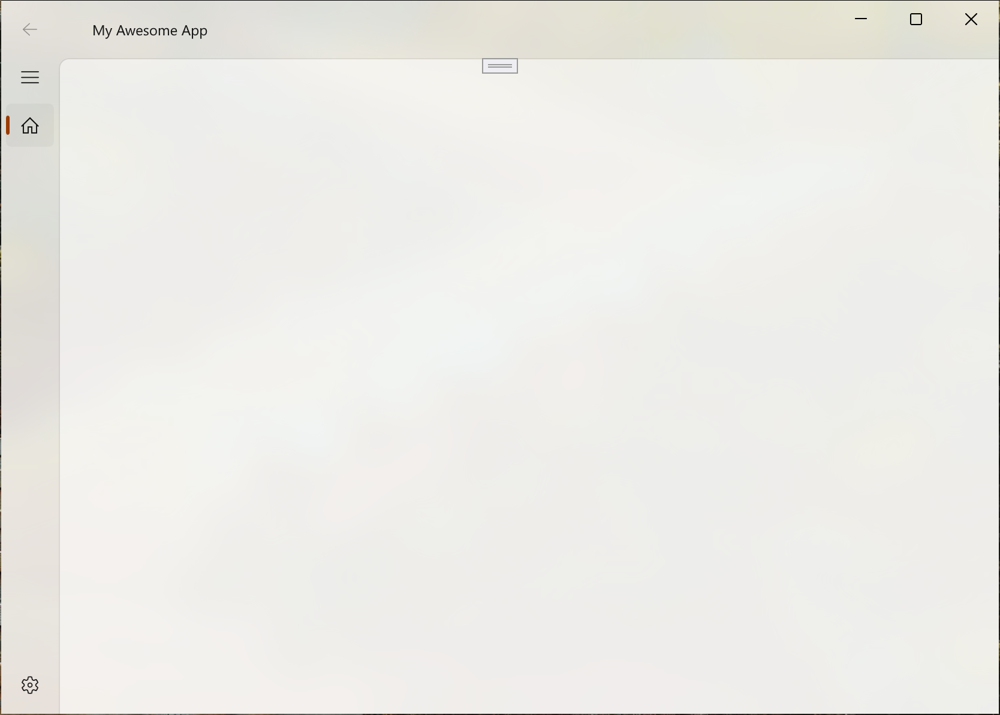

# The State of The Windows App SDK

It’s spring time! Come and see Microsoft’s latest and greatest installment of the famous long-running series: _Who Wants to Make The Best UI Framework_! This article contains insights on things to pay attention to, and a _quick_ tour for getting started for everyone interested in developing apps with the Windows App SDK.

<!-- more -->

## History

Actually, the Windows App SDK traces back to the time of Windows 8 (again?).

!!! note "Can you maybe talk about something other than Windows 8 please?"

    Woah, woah, hang on there. Of course there is way more stuff for me to talk about other than Windows 8. But just for the record, please allow me to finish this (at least I tried to make it so) _brief_ history lesson.

    For the full version to this brief excerpt, see _[A Rant About The Consistency of Windows](./windows-consistency.md)_. This chapter is more like a continuation of the chapter [Project Reunion](./windows-consistency.md#project-reunion) in the post.

    If you are **really** on a busy day, skip to [Getting started](#getting-started).

??? note "Do I really hate Windows 8?"

    Short version: I **don’t** hate Windows 8, period.

    Long version: While the number of reasons for one to hate Windows 8 may be astronomical, credit where credit is due: it is still a great step forward for such a creaking grandma OS like Windows, in which lots of critical and fundamental changes (that nobody recognized) have been implemented under the hood to modernize the system, which also set the foundation for Windows 10’s success. I personally do not blame Microsoft for aggressive technological advancements (or catch-ups, to be honest). I even have a Windows 8.1 virtual machine as my sandbox for its lightness (compared with Windows 10) and snappiness, yet it is still a relatively modern Windows system that can run most applications just fine.

    And hey, smileys! When your system unfortunately crashes _again_ for that goddamn NVIDIA or AMD driver, certainly a \:\( face is way friendlier than a cryptic, white-text-on-blue screen right?

The TL;DR is that when [Windows 8 was launched in 2012](./windows-consistency.md#windows-8), along is the new, flat design language (formerly called _Metro_ or _Modern_), whose UI framework was named as _WinUI_. Following the unfortunate trainwreck, Microsoft performed a major overhaul upon Windows’s visual design. The result of which is Windows 10, with a new design language that is now called _Microsoft Design Language 2_. And the name of the framework for this is? You guessed it right: _WinUI 2_.

But apparently, even with the launch of Windows 10, there are still plenty of apps that took advantage of neither WinUI nor WinUI 2. These are apps that draw their own interfaces in other ways, like old Win32 MFC, WinForms, WPF, Qt, GTK, Electron, etc. While others might be beyond Microsoft’s ability to intervene with, the first three are developed and maintained entirely by Microsoft. Thus looking at this mess, Microsoft planned to make something to unite all these scattered frameworks, something codenamed _Project Reunion_. The UI framework of which is officially called _WinUI 3_. And when Project Reunion reached its first 1.0 stable release, it was called the _Windows App SDK_, which suggests that it’s now the official Microsoft technology for building native apps on Windows. To summarize it all up:

| Windows version | Design language | UI framework |
| :-------------- | :-------------- | :----------- |
| Windows 8 / 8.1 | MDL / “Metro”   | WinUI        |
| Windows 10      | MDL 2 / Fluent  | WinUI 2      |
| Windows 11      | Fluent 2        | WinUI 3      |

## Knowing the benefits and limitations

Bear in mind that the Windows App SDK can be seen as a spiritual successor to the Universal Windows Platforms (UWP). Thus many features and syntaxes in UWP development are passed along to Windows App SDK as well.

Like with UWP, when you are developing apps with the Windows App SDK, the most obvious benefit is having access to all modern Windows controls and their designs. You no longer have to worry about display scaling factors, light/dark mode detection, etc.

So what makes it different from UWP, other than its name? What are the benefits, limitations and caveats of using it? I’ll list a few points worth mentioning (not comprehensive):

### Packaged and unpackaged

Before XAML Islands and Windows App SDK, the only way to use modern Windows controls (without some black magic wizardry) is to develop a “packaged” app, which is sandboxed, uses WinRT APIs and have no direct access to Win32 APIs, heck, even JITs are not allowed (hence the development of .NET Native). Those strict restrictions severely limited what developers can do: you either pick a fancy interface and have your arms and legs tied up, or pick an older interface and enjoy the freedom of ransacking through everywhere where UAC is absent. Although Microsoft did later allow traditional “desktop apps” to be packaged and avoid being sandboxed, accessing modern Windows controls and WinRT APIs is still a hurdle.

The Windows App SDK allows both packaged and unpackaged apps, meaning that unpackaged apps can easily access those APIs as well. Even if your app is packaged, you can opt out of sandboxing, effectively bypassing the limits on UWP apps.

### Benefits

There are certainly benefits from migrating to such a new framework, here are some of the examples:

- (For .NET developers) Access to .NET features otherwise unavailable to UWP development
- Packaged and unpackaged option
- Access to all Win32 APIs via P/Invoke
- Access to WinRT APIs under `Windows` namespace[^1]
- Access to modern, native Windows controls
- Access to Windows materials (Acrylic and Mica)[^2]
- Access to Chromium Edge-powered WebView2 control
- Automatic display scaling support
- Automatic system accent theming support
- Automatic light/dark mode support
- Automatic, responsive layout options
- UX stack decoupled from OS (Windows 11 style on Windows 10)
- Compile-time, powerful `{x:Bind}` binding instead of runtime, reflection-based `{Binding}`
- Implicit and connected animations
- Text rendering with DirectWrite
- Composition and animation with DirectX

### Limitations

These are some of the features available in older frameworks but absent in the current version of Windows App SDK. You might want to take a look at these to see if those trade-offs are worth making the switch.

#### No UI preview in IDE

**Available on**: WinForms, WPF, UWP, Qt, or anything remotely modern.

This is the _numer uno_ hurdle that is most annoying and has been troubling me the most. Familiar with WinForms or WPF development? Remember the Preview tab showing you what your product may look like? You like using Blend? Bam! Gone!

<figure markdown="span">
  
  <figcaption>No UI preview is available in Visual Studio, same for Blend</figcaption>
</figure>

??? note "Some rants"

    Gee, Microsoft, you are a multi-trillion-dollar corporation, yet you didn’t even bother to implement such _basic_ feature in your flagship product: the Visual Studio IDE. If making a UI preview does not earn you any extra money, then you should stop making WinUI 3 altogether, since apparently it does not earn you any extra money either, why not just, once again, put those R&D budget to Azure?

When Windows App SDK was released, I was _shocked_ to see that there is not even a sign of a UI designer, not even preview. It is not even on the freaking roadmap. And apparently Microsoft’s idea is that “but you can use Hot Reload and Live Visual Tree!” So do not expect to have it in the near future.

More resources: [GitHub discussion :octicons-link-external-16:](https://github.com/microsoft/microsoft-ui-xaml/issues/5917), [Windows App SDK roadmap :octicons-link-external-16:](https://portal.productboard.com/winappsdk/1-windows-app-sdk/tabs/7-backlog).

#### Missing windowing APIs

The ironic fact is that the _Windows_ App SDK is lacking some _windowing_ APIs available on older frameworks. Here are some of the stuff that you do not have control over out-of-the-box:

- Initial size, title and window icon
- Initial location (default / center of screen)
- Maximum and minimum height and width (both initial and runtime)
- Window resize mode
- Topmost state
- Can be maximized / minimized
- Programmatic maximization / minimization

In the early days of Windows App SDK, you don’t even have out-of-the-box control over window title.

Fortunately you can regain all these missing abilities with the amazing [WinUIEx :octicons-link-external-16:](https://dotmorten.github.io/WinUIEx/index.html) package. In case if you missed yet another ironic fact: even Microsoft’s own WinUI 3 template project is using it as a workaround for many missing features, including — that’s right: setting default window title.

#### No .NET Native

.NET Native is born to meet the restriction of UWP where no JIT is allowed during runtime. As its name implies, instead of the normal lifecycle of .NET, in which code files are compiled into the CIL intermediate format during compile time, and then dynamically interpreted and executed by JIT during runtime, the .NET Native toolchain compiles the emitted intermediate format straight into binary instructions that match target platform architecture. The result of which is vastly superior application performance and overall snappier user experience that rivals some of those written in C++[^3].

However in all these years, .NET Native seemed to be and remained exclusive to UWP development. It’s pity that no one can enjoy it when building anything that is not UWP. Thus you’ll lose that as well if you use the Windows App SDK for development.

#### No Xbox support

Your app built with the Windows App SDK, even if packaged as MSIX, cannot be installed or run on Xbox devices. Likewise, without explicit implementation, users on desktop cannot navigate in your app with the Xbox Controller like they could with UWP apps, either.

#### Too much boilerplate

This is technically not a limitation, but rather a design failure. It will not limit you from doing anything, but rather cripple your development flow.

Just the default template project created with Template Studio has **more than 20 boilerplate files** serving different purposes, and by default your app is based on Dependency Injection (a tough concept for many beginners). Plus, your solution is split into two projects: `ProjectName` and `ProjectName.Core`, for cross-platform portability reasons.

<figure markdown="span">
  { width="400" }
  <figcaption>Seriously?</figcaption>
</figure>

Hear me out: it is **way too complicated** for just a **template**, and can be overwhelming for even seasoned developers, let alone first-timers trying native Windows development. With each new project, developers have to waste hours examining the template and making necessary adjustments, before being able to do any practical development. There shouldn’t be this many boilerplates in a template project, and you shouldn’t have carved an entire application architecture for developers, either. This much code should be put somewhere else as a “reference project”, or be transformed into a tutorial for building applications with such design paradigm. A _“template”_ should be as simple as which in Windows Forms and WPF, with only the bare minimum to get an application _running_, instead of _functional_.

Even worse, much of what the boilerplate files did is botches and patches for problems that shouldn’t have existed in the first place, and could have been integrated into the Windows App SDK ages ago. Those are framework-level problems, and there are tens of thousands of possible ways of fixing them available for choose, yet the one chosen by Microsoft is the stupidest among the stupidest: by including workarounds in every single template project, thus integrating them into all apps built with the SDK. This effectively planted bombs in every single app built with the Windows App SDK. And in the future, extra workarounds may be required for the workarounds implemented by those apps and now causing troubles, and this time you cannot simply fix them by changing templates. Templates are permanent, fixed at the start of development, and cannot be easily changed during lifetime like frameworks and dependencies are. Nobody wants the death spiral of workarounds, workarounds for workarounds, workarounds for workarounds for workarounds, etc.

Fortunately, you can start from scratch, relatively easily, actually. And that will be my recommended approach to developing with the Windows App SDK as well. Kinda like using Arch Linux or Gentoo, where you have full knowledgement of what you have now and what you’ve changed before, instead of other well-equipped distros that come with a graphical user interface by default.

But the unfortunate fact is that by going this way, you are now the one to write boilerplates to fix problems that should have been fixed by Microsoft. You must face the fact that there is no way around boilerplates when developing with the Windows App SDK, regardless if you choose to go with templates or start from scratch.

<figure markdown="span">
  
  <figcaption>Pre-defined, hard-coded values?</figcaption>
</figure>

## Getting started

If you’re happy to accept those challenges, let’s jump right in.

This tutorial is more for people with some C# and WPF development experience. If you have no previous experience, it may be really not for you.

### Choosing tools

There really isn’t much to talk about the tool choices, as the number of available picks in the C# ecosystem is nowhere near Java.

#### Visual Studio

The most obvious is Microsoft’s own [:simple-visualstudio: Visual Studio :octicons-link-external-16:](https://visualstudio.microsoft.com/). You will need Visual Studio 2022 or later for development with the Windows App SDK. When installing, choose at least “.NET Desktop Development” workload and “Windows App SDK C# Templates” under optional components in the “Installation details” sidebar.

!!! note "Template Studio"

    If you really want a wizard-based experience for creating project templates (that yourself may need an awful lot of time to comprehend) tailored to your needs. You can download the Template Studio plugin for Visual Studio [here :octicons-link-external-16:](https://marketplace.visualstudio.com/items?itemName=TemplateStudio.TemplateStudioForWinUICs).

#### JetBrains Rider

The second is [:simple-rider: Rider :octicons-link-external-16:](https://www.jetbrains.com/rider/) by JetBrains. It offers powerful and comprehensive debugging tools like Predictive Debugger, and has great support for XAML development. Its auto-import and formatting is way more reliable than Visual Studio (for whatever reason auto-import breaks all the time and is nearly unusable on my Visual Studio installation), and IMHO, offers better overall experience for .NET development.

!!! danger "Rider has no full support for Windows App SDK projects"

    If you’ve decided to go with Rider, you should know that Rider has no full support for Windows App SDK projects yet. While regular code editing, autocompletion, code analysis are ok, debugging is borked (see [RIDER-68942 :octicons-link-external-16:](https://youtrack.jetbrains.com/issue/RIDER-68942/Cant-debug-WinUI3-app-runtme-error) for details), meaning that you may still need Visual Studio for complete development experience. **This tutorial will focus on development flow with Visual Studio and may not cover Rider in all cases.**

### Creating the project

!!! success "Deciding the scale of your project"

    Your project may be large: a fully-fledged CRM system with all kinds of bells and whistles, or small: a simple utility or widget with one focused goal. You need to pick different architectures for different kinds of projects with different purposes and requirements on scalability. This decides the template you choose.

Now that you have the required tools, you can create your first project. Depending on the scale of your project, you may either choose to start from an empty canvas (recommended) or with Template Studio to set up everything for you.

- To start with Template Studio: when creating the new project, search for “**Template Studio for WinUI**”, and follow instructions.
- To start from scratch: when creating the new project, search for “**Blank app, packaged (WinUI 3 on Desktop)**”.

## Boilerplates

If you created your new project with Template Studio, then all required boilerplates are already in place.

If not, depending on the scale of your project, you may want to consider adding the following boilerplates. Those are not necessary for development, but might make your life a bit easier.

### Basic setup

Here are some basic setup steps regardless of the scale of your application.

#### Restoring windowing APIs

To restore missing windowing functionalities, consider installing the `WinUIEx` package:

In your IDE, search for the `WinUIEx` package in NuGet Tool, or with command line:

```bash
dotnet add package WinUIEx
```

Then, change the base class of the windows in your application to `WinUIEx.WindowEx` by:

1. In the `.xaml` file of your target window, add `xmlns:winuiex="using:WinUIEx"` to your `Window` element, making it look like:
    ```xml hl_lines="7"
    <Window
        ...
        xmlns="http://schemas.microsoft.com/winfx/2006/xaml/presentation"
        xmlns:x="http://schemas.microsoft.com/winfx/2006/xaml"
        xmlns:d="http://schemas.microsoft.com/expression/blend/2008"
        xmlns:mc="http://schemas.openxmlformats.org/markup-compatibility/2006"
        xmlns:winuiex="using:WinUIEx"
        ...
    ```
2. Change the base class of your `Window` element to `winuiex:WindowEx`:
    ```xml hl_lines="1"
    <winuiex:WindowEx
        ...
        xmlns="http://schemas.microsoft.com/winfx/2006/xaml/presentation"
        xmlns:x="http://schemas.microsoft.com/winfx/2006/xaml"
        xmlns:d="http://schemas.microsoft.com/expression/blend/2008"
        xmlns:mc="http://schemas.openxmlformats.org/markup-compatibility/2006"
        xmlns:winuiex="using:WinUIEx"
        ...
    ```
3. In the `.xaml.cs` file of the window, either just directly remove the base class annotation, and you’re done:
    ```csharp
    public sealed partial class MainWindow
    ```
    This is acceptable because it is a `partial` class. Or you can import the namespace `WinUIEx` and change the base class type to `WinUIEx.WindowEx`.

You can visit [the project’s homepage :octicons-link-external-16:](https://dotmorten.github.io/WinUIEx/concepts/WindowEx.html) for more information on its usage.

#### Setting up branding

As WinUI applications are now based on .NET, the recommended approach to changing the attributes and metadata of output assembly is no longer attributes in `AssemblyInfo.cs`, but rather manipulating values in the `.csproj` project file directly.

To set application icon:

1. Create `Assets` folder in your project if not present[^4].
2. Put your application icon (preferably both `.ico` and `.png`) inside it.
3. Select the file(s) in Solution Explorer, make sure to have the following properties set:
      1.  Build Action: `Content`.
      2.  Copy to Output Directory: `Always`.
4. Edit the `.csproj` file, add the following line:
    ```xml
    <ApplicationIcon>Assets\Icon.ico</ApplicationIcon>
    ```
   You can also group it with other metadata with a `PropertyGroup` like:
    ```xml hl_lines="9"
    <PropertyGroup>
      <!-- File description -->
      <AssemblyTitle>Lorem ipsum Utility - The Lorem ipsum Generator</AssemblyTitle>
      <!-- Assembly name -->
      <Product>Lorem ipsum Utility</Product>
      <Copyright>Copyright © 2024, Contoso Inc.</Copyright>
      <Company>Contoso Inc.</Company>
      <!-- Icon of output .exe assembly -->
      <ApplicationIcon>Assets\Icon.ico</ApplicationIcon>
    </PropertyGroup>
    ```
5. For every window that you want to set icon as such, add this line to your constructor:
    ```csharp
    AppWindow.SetIcon(Path.Combine(AppContext.BaseDirectory, "Assets/Icon.ico"));
    ```
   You may need to import the following namespaces:
    ```csharp
    using Microsoft.UI.Windowing;
    using System;
    using System.IO;
    ```

    !!! danger "Absolute path is required for the `AppWindow.SetIcon()` API"

        Unfortunately `AppWindow.SetIcon()` is just a P/Invoke wrapper for the underlying Win32 API and does not accept relative paths. Thus a `Path.Combine()` function call is required to get the absolute path to our icon file.

        If you specified an invalid path, no exceptions will be thrown to remind you that something has gone wrong, but you will see no icon in the ++alt+tab++ UI as a result.

With application icon set up, if you followed the steps above and created a `PropertyGroup` in your project file, simply modify those values to change other attributes.

#### Changing window title

If you have already installed the `WinUIEx` package with the steps above, you can simply change the `Title` property in XAML file to change window title _(just like the good old days before with WPF)_.

If not, or you want to change window title programmatically, use (preferably in the constructor of your window):

```csharp
AppWindow.Title = "My Awesome App";
```

#### Setting up system dialogs

Unfortunately you will need to perform the setups **every single time** you use any system dialog types (except `ContentDialog`, which is drawn by the app itself) like:

- `Windows.UI.Popups.MessageDialog`
- `Windows.Storage.Pickers.FileOpenPicker`
- `Windows.Storage.Pickers.FileSavePicker`

Before calling the function to show the dialog, you will need to “initialize” it:

```csharp
InitializeWithWindow.Initialize(dialog, WindowNative.GetWindowHandle(this));
```

To call this function, you need to import the `WinRT.Interop` namespace.

Fortunately, once again, if you have installed the `WinUIEx` package, you can call the corresponding extension methods to create dialogs that are already initialized with the window:

```csharp
var messageDialog = this.CreateMessageDialog(
    "The application has encountered a critical error and will be closing now.",
    "Critical Error");
var fileSaveDialog = this.CreateSaveFilePicker();
var fileOpenDialog = this.CreateOpenFilePicker();
```

#### Setting up `ContentDialog`

As of writing, for whatever reason, the default style of `ContentDialog` is not automatically applied, resulting in missing opening/entrance animation (it just _pops_ open) and thus a bad, inconsistent user experience. See GitHub issue [#5573 :octicons-link-external-16:](https://github.com/microsoft/microsoft-ui-xaml/issues/5573), [#8476 :octicons-link-external-16:](https://github.com/microsoft/microsoft-ui-xaml/issues/8476) for more information. This bug has been present since July 2021, and hasn’t been fixed for almost 3 years, requiring developers to use workarounds, while once again highlighting Microsoft’s [commitment issue](./windows-consistency.md#project-reunion).

You will also need to specify the `ContentDialog`’s `XamlRoot` property to kind of “set which window it needs to be attached to”.  

Fortunately you can fix this relatively simply by just two lines:

```csharp
dialog.Style = Application.Current.Resources["DefaultContentDialogStyle"] as Style;
dialog.XamlRoot = Content.XamlRoot;
```

Or if you hate leaving hard-coded litter everythere, consider creating an extension method:

```csharp
using Microsoft.UI.Xaml;
using Microsoft.UI.Xaml.Controls;

namespace MyAwesomeApp.Extensions;

public static class ContentDialogExtensions
{
    public static void ApplyFixesMicrosoftDidNotBotherTo(this ContentDialog contentDialog, Window baseWindow)
    {
        contentDialog.Style = Application.Current.Resources["DefaultContentDialogStyle"] as Style;
        contentDialog.XamlRoot = baseWindow.Content.XamlRoot;
    }
}
```

And later call it for every `ContentDialog` you create:

```csharp hl_lines="8"
var updateDialog = new ContentDialog
{
    PrimaryButtonText = "OK",
    DefaultButton = ContentDialogButton.Primary,
    Title = "Friendly Alert",
    Content = "Hey, time to update your Windows!"
};
updateDialog.ApplyFixesMicrosoftDidNotBotherTo(this);

await updateDialog.ShowAsync();
```

Or even better, you can create an extension method that performs fixes and shows the dialog in one call:

```csharp
public static Task<ContentDialogResult> ShowWithFixesAsync(this ContentDialog contentDialog, Window baseWindow)
{
    contentDialog.Style = Application.Current.Resources["DefaultContentDialogStyle"] as Style;
    contentDialog.XamlRoot = baseWindow.Content.XamlRoot;

    return contentDialog
        .ShowAsync()
        .AsTask();
}
```

#### Adding Mica and Acrylic material support

[Acrylic :octicons-link-external-16:](https://learn.microsoft.com/en-us/windows/apps/design/style/acrylic) is the default material in Windows 10 and [Mica :octicons-link-external-16:](https://learn.microsoft.com/en-us/windows/apps/design/style/mica) is the default material in Windows 11.

To use Acrylic as the base material for your app window, add the following lines to your XAML file under `Window` node:

```xml
<Window.SystemBackdrop>
    <DesktopAcrylicBackdrop/>
</Window.SystemBackdrop>
```

Likewise, to use Mica:

```xml
<Window.SystemBackdrop>
    <MicaBackdrop/>
</Window.SystemBackdrop>
```

For all pages displayed in the window, remember to clear the `Background` property if present.

But what if we want the app to use Mica where possible (Windows 11), and Acrylic as fallback? Luckily we can detect Windows version and programmatically set base material in window constructor:

```csharp
// Set Mica or Acrylic backdrop according to system version
if (Environment.OSVersion.Version.Build >= 22000)
    SystemBackdrop = new MicaBackdrop();
else
    SystemBackdrop = new DesktopAcrylicBackdrop();
```

??? note "Detecting Windows 11"

    As of writing, Microsoft did not publish any official way to detect if current Windows version is Windows 11. The most reliable way seems to be checking build number: the initial release of Windows 11’s system version reads `10.0.22000.0`, thus anything ≥ 22000 is Windows 11, and anything less than 22000 is Windows 10.

    There is one caveat: to detect Windows version reliably without the system API triggering compatibility mode and returning `6.2.9200.0` (the version of Windows 8), you will need to explicitly declare that you support Windows 10 (and later) in your `app.manifest` file:

    ```xml hl_lines="6"
    <compatibility xmlns="urn:schemas-microsoft-com:compatibility.v1">
      <application>
        <!-- The ID below informs the system that this application is compatible with OS features first introduced in Windows 10. 
        It is necessary to support features in unpackaged applications, for example the custom titlebar implementation.
        For more info see https://docs.microsoft.com/windows/apps/windows-app-sdk/use-windows-app-sdk-run-time#declare-os-compatibility-in-your-application-manifest -->
        <supportedOS Id="{8e0f7a12-bfb3-4fe8-b9a5-48fd50a15a9a}" />
      </application>
    </compatibility>
    ```

    It should come shipped with any template of WinUI 3, including the Blank App one.

    See the [Stack Overflow discussion :octicons-link-external-16:](https://stackoverflow.com/questions/69373447/is-there-an-official-way-to-detect-windows-11) and [confirmation from Microsoft employee :octicons-link-external-16:](https://learn.microsoft.com/en-us/answers/questions/586619/windows-11-build-ver-is-still-10-0-22000-194) on Microsoft Learn for more information.

#### Setting up data binding

Unfortunately there is still no built-in observable type for MVVM development in WinUI 3. There are two popular ways for you to choose:

1. Developing your own base observable type
2. Use [MVVM Toolkit :octicons-link-external-16:](https://learn.microsoft.com/en-us/dotnet/communitytoolkit/mvvm/) (recommended)

We will introduce the first one in this tutorial. For the latter one, check out its documentation.

First, create a base class:

```csharp title="ObservableBase.cs"
using System.ComponentModel;
using System.Runtime.CompilerServices;

namespace MyAwesomeApp.ViewModels;

public class ObservableBase : INotifyPropertyChanged
{
    public event PropertyChangedEventHandler? PropertyChanged;

    protected void NotifyPropertyChanged([CallerMemberName] string propertyName = "")
        => PropertyChanged?.Invoke(this, new PropertyChangedEventArgs(propertyName));
}
```

Then, create the class for view model:

```csharp title="MainWindowViewModel.cs"
public class MainWindowViewModel : ObservableBase
{

}
```

Then, for your view models, for every property, you will need a **backing store** for storing data and a **property** for triggering update events:

```csharp
private string _versionString = string.Empty;

public string VersionString
{
    get => _versionString;
    set { _versionString = value; NotifyPropertyChanged(); }
}
```

For computed properties:

```csharp
public int VersionStringLength => _versionString.Length;
```

When changing the backing store value, you should notify changes of all potentially affected properties:

```csharp hl_lines="10 14"
private string _versionString = string.Empty;

public string VersionString
{
    get => _versionString;
    set
    {
        _versionString = value;
        NotifyPropertyChanged();
        NotifyPropertyChanged(nameof(VersionStringLength));
    }
}

public int VersionStringLength => _versionString.Length;
```

Finally, in UI code, to bind to a value with `{x:Bind}`:

1. Initialize view model object:
    ```csharp title="MainWindow.xaml.cs"
    private MainWindowViewModel ViewModel { get; } = new();
    ```
2. Bind to value in XAML:
    ```xml title="MainWindow.xaml"
    <TextBlock Text="{x:Bind ViewModel.VersionString}"/>
    ```

    !!! danger "Write properties properly!"

        Do **NOT** write something like:

        ```csharp
        private MainWindowViewModel ViewModel => new();
        ```

        As it’s equivalent to:

        ```csharp
        private MainWindowViewModel ViewModel()
        {
            return new MainWindowViewModel();
        }
        ```

        And creates **new instances** for **every bind request**. Thus all changes are effectively discarded, and your memory is stuffed with instances of view models.

    !!! warning "Beware of bind mode difference from WPF"

        The default bind mode for `{x:Bind}` in UWP and WinUI 3 is different from WPF, which uses `TwoWay` as the default value. `{x:Bind}` uses `OneTime` as default value for performance reasons. You need to bear this in mind when developing WinUI 3 applications.

        There are two ways to control this behavior:

        1. Explicitly specify bind mode:
          ```xml
          <TextBlock Text="{x:Bind ViewModel.VersionString, Mode=OneWay}"/>
          ```
        2. Change default bind mode for the element and all children with [`x:DefaultBindMode` attribute :octicons-link-external-16:](https://learn.microsoft.com/en-us/windows/uwp/xaml-platform/x-defaultbindmode-attribute):
          ```xml hl_lines="2"  
          <Window
              x:DefaultBindMode="OneWay"
              x:Class="MyAwesomeApp.MainWindow"
              ...>
          ```

#### Setting app as unpackaged

Sometimes you just want your app to run without being packaged. Plus, packaged apps require valid digital signatures to be installable on other devices, making it troublesome for private distribution. If you want your app to be unpackged, do the following steps:

1. In your project file, add:
    ```xml
    <WindowsPackageType>None</WindowsPackageType>
    ```
2. On your IDE, select run target to `ProjectName (Unpackaged)`.

And you should now be able to run and distribute your app just like the old days. By default your app does not ship the Windows App SDK version required for your app to run (meaning that users must have Windows App SDK installed on their systems to be able to run your app), you can add this line to your project file to include it with your app:

```xml
<WindowsAppSDKSelfContained>true</WindowsAppSDKSelfContained>
```

### Setup for navigational app

If you wants your application to use the standard navigational design paradigm, you may need additional setups to get started. We do not use Dependency Injection in this tutorial, despite its elegance and benefit for future maintainability, as it may get too overwhelming for many readers.

#### Boilerplate resources

By default, if you use a `NavigationView` control directly, you will see margins being incorrect and alignments being off. This is because somehow Microsoft still didn’t manage to embed some required resources into the framework itself. So they decided that as a developer, it’s your job to put those in your app. Here are some lines freshly ripped off the template project created with Template Studio:

1. Create a folder in your project named `Styles`.
2. In your `App.xaml`, add the highlighted lines:
    ```xml title="App.xaml" hl_lines="4-6"
    <ResourceDictionary.MergedDictionaries>
        <XamlControlsResources xmlns="using:Microsoft.UI.Xaml.Controls" />
        <!-- Other merged dictionaries here -->
        <ResourceDictionary Source="/Styles/FontSizes.xaml" />
        <ResourceDictionary Source="/Styles/Thickness.xaml" />
        <ResourceDictionary Source="/Styles/TextBlock.xaml" />
    </ResourceDictionary.MergedDictionaries>
    ```
3. Create the style files:

    ??? note "`/Styles/FontSizes.xaml`"

        Serving `/Styles/TextBlock.xaml`, can be removed with it altogether.

        ```xml
        <ResourceDictionary
            xmlns="http://schemas.microsoft.com/winfx/2006/xaml/presentation"
            xmlns:x="http://schemas.microsoft.com/winfx/2006/xaml">

            <x:Double x:Key="LargeFontSize">24</x:Double>
            <x:Double x:Key="MediumFontSize">16</x:Double>

        </ResourceDictionary>
        ```

    ??? note "`/Styles/Thickness.xaml`"

        ```xml
        <ResourceDictionary
            xmlns="http://schemas.microsoft.com/winfx/2006/xaml/presentation"
            xmlns:x="http://schemas.microsoft.com/winfx/2006/xaml">

            <Thickness x:Key="LargeTopMargin">0,36,0,0</Thickness>
            <Thickness x:Key="LargeTopBottomMargin">0,36,0,36</Thickness>

            <Thickness x:Key="MediumTopMargin">0,24,0,0</Thickness>
            <Thickness x:Key="MediumTopBottomMargin">0,24,0,24</Thickness>
            <Thickness x:Key="MediumLeftRightMargin">24,0,24,0</Thickness>
            <Thickness x:Key="MediumBottomMargin">0,0,0,24</Thickness>

            <Thickness x:Key="SmallLeftMargin">12,0,0,0</Thickness>
            <Thickness x:Key="SmallLeftRightMargin">12,0,12,0</Thickness>
            <Thickness x:Key="SmallTopMargin">0,12,0,0</Thickness>
            <Thickness x:Key="SmallRightMargin">0,0,12,0</Thickness>
            <Thickness x:Key="SmallTopBottomMargin">0,12,0,12</Thickness>

            <Thickness x:Key="XSmallLeftMargin">8,0,0,0</Thickness>
            <Thickness x:Key="XSmallTopMargin">0,8,0,0</Thickness>
            <Thickness x:Key="XSmallLeftTopRightBottomMargin">8,8,8,8</Thickness>

            <Thickness x:Key="XXSmallTopMargin">0,4,0,0</Thickness>
            <Thickness x:Key="XXSmallLeftTopRightBottomMargin">4,4,4,4</Thickness>

            <Thickness x:Key="NavigationViewContentGridBorderThickness">1,1,0,0</Thickness>
            <CornerRadius x:Key="NavigationViewContentGridCornerRadius">8,0,0,0</CornerRadius>
            <Thickness x:Key="NavigationViewContentMargin">0,48,0,0</Thickness>
            <Thickness x:Key="NavigationViewHeaderMargin">56,34,0,0</Thickness>
            <Thickness x:Key="NavigationViewPageContentMargin">56,24,56,0</Thickness>

            <Thickness x:Key="MenuBarContentMargin">36,24,36,0</Thickness>

            <Thickness x:Key="SettingsPageHyperlinkButtonMargin">-12,4,0,0</Thickness>

        </ResourceDictionary>
        ```
    
    ??? note "`/Styles/TextBlock.xaml`"

        Additional pre-defined styles for `TextBlock` control, requires `/Styles/FontSizes.xaml`.

        ```xml
        <ResourceDictionary
            xmlns="http://schemas.microsoft.com/winfx/2006/xaml/presentation"
            xmlns:x="http://schemas.microsoft.com/winfx/2006/xaml">

            <Style x:Key="PageTitleStyle" TargetType="TextBlock">
                <Setter Property="VerticalAlignment" Value="Center" />
                <Setter Property="FontWeight" Value="SemiLight" />
                <Setter Property="FontSize" Value="{StaticResource LargeFontSize}" />
                <Setter Property="TextTrimming" Value="CharacterEllipsis" />
                <Setter Property="TextWrapping" Value="NoWrap" />
            </Style>

            <Style x:Key="BodyTextStyle" TargetType="TextBlock">
                <Setter Property="FontWeight" Value="Normal" />
                <Setter Property="FontSize" Value="{StaticResource MediumFontSize}" />
                <Setter Property="TextTrimming" Value="CharacterEllipsis" />
                <Setter Property="TextWrapping" Value="Wrap" />
            </Style>

        </ResourceDictionary>
        ```

#### Main window

Remove everything in the `Window` node, making it something like this:

```xml title="MainWindow.xaml"
<?xml version="1.0" encoding="utf-8"?>
<winuiex:WindowEx
    x:Class="MyAwesomeApp.MainWindow"
    xmlns="http://schemas.microsoft.com/winfx/2006/xaml/presentation"
    xmlns:x="http://schemas.microsoft.com/winfx/2006/xaml"
    xmlns:local="using:MyAwesomeApp"
    xmlns:d="http://schemas.microsoft.com/expression/blend/2008"
    xmlns:mc="http://schemas.openxmlformats.org/markup-compatibility/2006"
    xmlns:winuiex="using:WinUIEx"
    mc:Ignorable="d">

</winuiex:WindowEx>
```

The goal is to have a visual tree like this:

- Root (Window / `DesktopWindowXamlSource`)
    - Root content grid (`Grid`)
        - Custom title bar (`Grid`)
        - Navigation view (`NavigationView`)
            - Navigation items (`NavigationViewItem`)
            - Content frame (`Frame`)
                - Actual page contents (`Page`)

To construct a scaffolding of this structure, let’s go step by step:

1. Add root content grid:
    ```xml hl_lines="11-17"
    <?xml version="1.0" encoding="utf-8"?>
    <winuiex:WindowEx
        x:Class="MyAwesomeApp.MainWindow"
        xmlns="http://schemas.microsoft.com/winfx/2006/xaml/presentation"
        xmlns:x="http://schemas.microsoft.com/winfx/2006/xaml"
        xmlns:local="using:MyAwesomeApp"
        xmlns:d="http://schemas.microsoft.com/expression/blend/2008"
        xmlns:mc="http://schemas.openxmlformats.org/markup-compatibility/2006"
        xmlns:winuiex="using:WinUIEx"
        mc:Ignorable="d">
        <Grid>
            <Grid.BackgroundTransition>
                <!-- Add implicit background transition to seamlessly
                     transition between light and dark mode -->
                <BrushTransition/>
            </Grid.BackgroundTransition>
        </Grid>
    </winuiex:WindowEx>
    ```
2. Add customized title bar:
    ```xml hl_lines="17-43"
    <?xml version="1.0" encoding="utf-8"?>
    <winuiex:WindowEx
        x:Class="MyAwesomeApp.MainWindow"
        xmlns="http://schemas.microsoft.com/winfx/2006/xaml/presentation"
        xmlns:x="http://schemas.microsoft.com/winfx/2006/xaml"
        xmlns:local="using:MyAwesomeApp"
        xmlns:d="http://schemas.microsoft.com/expression/blend/2008"
        xmlns:mc="http://schemas.openxmlformats.org/markup-compatibility/2006"
        xmlns:winuiex="using:WinUIEx"
        mc:Ignorable="d">
        <Grid>
            <Grid.BackgroundTransition>
                <!-- Add implicit background transition to seamlessly
                     transition between light and dark mode -->
                <BrushTransition/>
            </Grid.BackgroundTransition>
            <Grid
                x:Name="AppTitleBar"
                Canvas.ZIndex="1"
                Height="{x:Bind NavigationView.CompactPaneLength, Mode=OneWay}"
                IsHitTestVisible="True"
                VerticalAlignment="Top"
                Padding="0,0,140,0">
                <!-- Give way to window controls
                     (minimize / maximize / close) -->
                <Image
                    Source="/Assets/Icon.ico"
                    HorizontalAlignment="Left"
                    VerticalAlignment="Center"
                    Width="16"
                    Height="16"/>
                <TextBlock
                    x:Name="AppTitleBarText"
                    HorizontalAlignment="Left"
                    VerticalAlignment="Center"
                    TextWrapping="Wrap"
                    MaxLines="2"
                    Margin="28,0,0,0"
                    TextTrimming="CharacterEllipsis"
                    Style="{StaticResource CaptionTextBlockStyle}">
                    My Awesome App
                </TextBlock>
            </Grid>
        </Grid>
    </winuiex:WindowEx>
    ```
3. From code-behind, set custom title bar for the window in the constructor:
    ```csharp title="MainWindow.xaml.cs" hl_lines="5-6"
    public MainWindow()
    {
        InitializeComponent();

        ExtendsContentIntoTitleBar = true;
        SetTitleBar(AppTitleBar);
    }
    ```
4. Add navigation view:
    ```xml hl_lines="44-63"
    <?xml version="1.0" encoding="utf-8"?>
    <winuiex:WindowEx
        x:Class="MyAwesomeApp.MainWindow"
        xmlns="http://schemas.microsoft.com/winfx/2006/xaml/presentation"
        xmlns:x="http://schemas.microsoft.com/winfx/2006/xaml"
        xmlns:local="using:MyAwesomeApp"
        xmlns:d="http://schemas.microsoft.com/expression/blend/2008"
        xmlns:mc="http://schemas.openxmlformats.org/markup-compatibility/2006"
        xmlns:winuiex="using:WinUIEx"
        mc:Ignorable="d">
        <Grid>
            <Grid.BackgroundTransition>
                <!-- Add implicit background transition to seamlessly
                    transition between light and dark mode -->
                <BrushTransition/>
            </Grid.BackgroundTransition>
            <Grid
                x:Name="AppTitleBar"
                Canvas.ZIndex="1"
                Height="{x:Bind NavigationView.CompactPaneLength, Mode=OneWay}"
                IsHitTestVisible="True"
                VerticalAlignment="Top"
                Padding="0,0,140,0">
                <!-- Give way to window controls
                    (minimize / maximize / close) -->
                <Image
                    Source="/Assets/Icon.ico"
                    HorizontalAlignment="Left"
                    VerticalAlignment="Center"
                    Width="16"
                    Height="16"/>
                <TextBlock
                    x:Name="AppTitleBarText"
                    HorizontalAlignment="Left"
                    VerticalAlignment="Center"
                    TextWrapping="Wrap"
                    MaxLines="2"
                    Margin="28,0,0,0"
                    TextTrimming="CharacterEllipsis"
                    Style="{StaticResource CaptionTextBlockStyle}">
                    My Awesome App
                </TextBlock>
            </Grid>
            <NavigationView
                x:Name="NavigationView"
                Canvas.ZIndex="0"
                OpenPaneLength="200"
                IsBackButtonVisible="Visible"
                IsBackEnabled="{x:Bind ContentFrame.CanGoBack, Mode=OneWay}"
                IsSettingsVisible="True"
                BackRequested="NavigationView_BackRequested"
                DisplayModeChanged="NavigationView_DisplayModeChanged"
                ItemInvoked="NavigationView_ItemInvoked"
                PointerPressed="NavigationView_PointerPressed"
                ProcessKeyboardAccelerators="NavigationView_ProcessKeyboardAccelerators">
                <NavigationView.MenuItems>
                    <NavigationViewItem Icon="Home" Tag="HomePage" Content="Home"/>
                </NavigationView.MenuItems>
                <Frame
                    x:Name="ContentFrame"
                    x:FieldModifier="Public"
                    Navigated="ContentFrame_Navigated"/>
            </NavigationView>
        </Grid>
    </winuiex:WindowEx>
    ```
   By default we have one navigation item (Home), you can add more later on.
5. Create Home page and Settings page:
      1. Create a folder in your project named `Pages`.
      2. Right click `Pages`, add item type of `Blank Page (WinUI 3)`, name it as `HomePage`.
      3. Do the same above for `SettingsPage`, you will need the name to be exact to match the template code below.
6. Configure initial navigation in constructor:
    ```csharp hl_lines="8-9"
    public MainWindow()
    {
        InitializeComponent();

        ExtendsContentIntoTitleBar = true;
        SetTitleBar(AppTitleBar);

        NavigationView.SelectedItem = NavigationView.MenuItems.First();
        ContentFrame.Navigate(typeof(HomePage));
    }
    ```
7. Wire up events (remember to import `MyAwesomeApp.Pages` namespace!):
    ```csharp
    private void NavigationView_BackRequested(NavigationView sender, NavigationViewBackRequestedEventArgs args)
    {
        if (ContentFrame.CanGoBack)
            ContentFrame.GoBack();
    }

    private void NavigationView_DisplayModeChanged(NavigationView sender, NavigationViewDisplayModeChangedEventArgs args)
    {
        // Adapt to layout changes as the burger menu now lives on the title bar
        AppTitleBar.Margin = new Thickness()
        {
            Left = sender.CompactPaneLength * (sender.DisplayMode == NavigationViewDisplayMode.Minimal ? 2 : 1),
            Top = AppTitleBar.Margin.Top,
            Right = AppTitleBar.Margin.Right,
            Bottom = AppTitleBar.Margin.Bottom
        };
    }

    private void NavigationView_ItemInvoked(NavigationView sender, NavigationViewItemInvokedEventArgs args)
    {
        // Special detection for Settings page
        if (args.IsSettingsInvoked && ContentFrame.SourcePageType.Name == "SettingsPage") return;
        else if (ContentFrame.SourcePageType.Name == ((NavigationViewItem)args.InvokedItemContainer).Tag.ToString()) return;

        Type? targetType;
        if (args.IsSettingsInvoked)
            targetType = typeof(SettingsPage);
        else
            targetType = (args.InvokedItemContainer as NavigationViewItem)?.Tag switch
            {
                // Add references to pages here if you have added more pages in the future
                nameof(HomePage) => typeof(HomePage),
                _ => null
            };

        if (targetType is not null)
            ContentFrame.Navigate(targetType, null, args.RecommendedNavigationTransitionInfo);
    }

    private void ContentFrame_Navigated(object sender, NavigationEventArgs e)
    {
        // Automatically decide which navigation item should be selected
        if (e.SourcePageType == typeof(SettingsPage))
            NavigationView.SelectedItem = NavigationView.SettingsItem;
        else if (ContentFrame.SourcePageType != null)
        {
            var targetItem = NavigationView.MenuItems
                .OfType<NavigationViewItem>()
                .FirstOrDefault(i => i.Tag.Equals(ContentFrame.SourcePageType.Name));
            if (targetItem is not null)
                NavigationView.SelectedItem = targetItem;
        }
    }
    
    // Handle keyboard return shortcuts
    private void NavigationView_ProcessKeyboardAccelerators(UIElement sender, ProcessKeyboardAcceleratorEventArgs args)
    {
        if (args.Modifiers == VirtualKeyModifiers.Menu && args.Key == VirtualKey.Left ||
            args.Key == VirtualKey.GoBack ||
            args.Key == VirtualKey.XButton1)
        {
            if (ContentFrame.CanGoBack)
            {
                ContentFrame.GoBack();
                args.Handled = true;
            }    
        }
    }

    // Handle mouse back button
    private void NavigationView_PointerPressed(object sender, PointerRoutedEventArgs e)
    {
        if (e.GetCurrentPoint(NavigationView).Properties.IsXButton1Pressed && ContentFrame.CanGoBack)
        {
            ContentFrame.GoBack();
            e.Handled = true;
        }
    }
    ```

Congratulations! You should now have a working navigational app that looked like this:



You can also save your project now as a template for all future projects.

## Onwards!

Now that your project is set up, you can carry on with your normal development procedure.

So to answer the question: what’s the state of the Windows App SDK? I’ll probably say: it’s usable, but **still** flawed, with many easily fixable bugs **overdue** for a long time. Every project needs tons of setup work, fixes and hacks by developers, and can cause further problems in the future.

Be sure to regularly check for release notes of the Windows App SDK to see if your hacks for some problems are finally fixed and can be removed. Chances are that Microsoft may not even dare to fix those problems when they finally have the time to do so, as fixes may break the workarounds, causing new problems by fixing old problems.

This is the commitment issue. Despite the great concepts, **Microsoft showed little commitment on this project, and had assigned very few resources for it.** Think twice before you make this investment, as the future of the Windows App SDK is very much unclear, and your hard work could be in tatters in no time. Stick to older frameworks like Windows Forms and WPF if you are hesitant making the move. Microsoft’s track record has clearly shown that they may torch this or that, they never had the bravery of torching those old working horses. Thus while you may not have access to the latest and greatest features, at least you are not at the risk of suddenly losing all investments, if you’re not making any investment at all.

[^1]: Some may require your app to be packaged (to have a [Package Identity :octicons-link-external-16:](https://learn.microsoft.com/en-us/windows/apps/desktop/modernize/package-identity-overview)) to work.
[^2]: Acrylic and Mica material support was added in a later release.
[^3]: Maybe everyone knew that even if your application is compiled into native binary, its performance is still nowhere near those written in C++ as there are still overheads from the framework and runtime. However this is not true in all scenarios. Take sorting algorithms for example, a badly written algorithm in C++ may perform way worse than .NET’s built-in, highly optimized `IEnumerable.Sort()` algorithm implementation, let alone the binary version compiled with .NET Native. I am fully aware of the fact that STL has a built-in, highly optimized sorting algorithm as well, but this is not the point of this discussion.
[^4]: Can be any arbitrary path, but `Assets` is the standard and recommended name.
