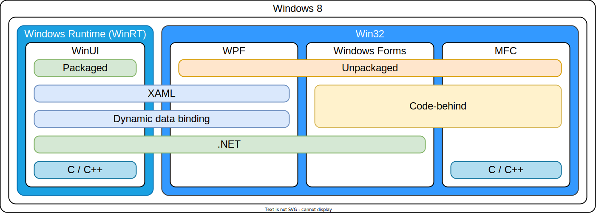
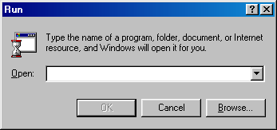
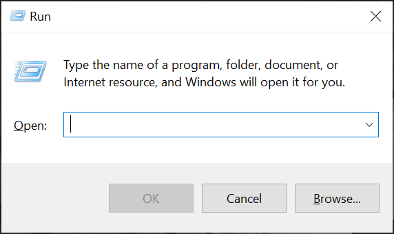
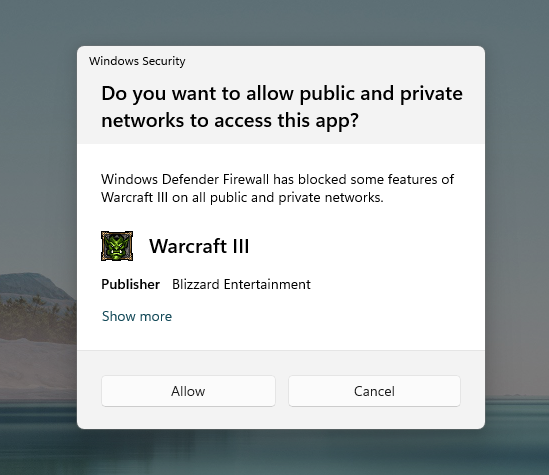

# A Rant About The Consistency of Windows

Born on November 10, 1983, Windows, at the time still based on MS-DOS, finally introduces the graphical user interface (GUI) to people using IBM PC (or its clones).

Follow the path of history, as we shed some light onto one of the greatest weaknesses in terms of user experience of Windows - historical relics and inconsistency.

<!-- more -->

It’s been 40 years since Windows was first introduced, and even longer for MS-DOS, which was introduced 2 years prior to Windows. Over almost half a century, Windows has evolved through many iterations. Its kernel, for example, has evolved from MS-DOS, to MS-DOS-based, to NT. Till now, the latest version of Windows is Windows 11. There is certainly no denying that every single modern operating system, including Windows, is a feat of engineering. But shiny as it is, Windows is a piece of software that is way too big. And history relics have found their way to today, some hiding in the corners, some visible everyday, most remain untouched for years. This creates a feel of inconsistency, making Windows messy and segmented, sharply visible in user interface.

## Simpler times

Microsoft has a very terrible track record of maintaining stuff. From Silverlight to Zune, from Metro apps to UWP, some of which are confirmed *D-E-A-D* dead, while some are de-facto dead. This has always been a problem troubling Microsoft, despite it being still pretty manageable in the XP era. Back then, for native application development, Microsoft offered developers a simple option: [:fontawesome-brands-wikipedia-w: Win32 MFC](https://en.wikipedia.org/wiki/Microsoft_Foundation_Class_Library) with C or C++. While developing Windows XP, Microsoft was also working on something called “.NET Framework”, formerly “Next Generation Windows Services” - a revolutionary framework that was set to make native application development way easier, safer, more efficient and reliable than ever before.

.NET Framework was a great idea, with C#, one the bundled languages, it introduced a [:fontawesome-brands-wikipedia-w: generational garbage collection](https://en.wikipedia.org/wiki/Tracing_garbage_collection#Generational_GC_(ephemeral_GC)) automatic memory management mechanism to developers familiar with C and C++ syntaxes, freeing them from the hassle of error-prone manual memory management. It’s like driving manual vs. automatic transmission cars. Sure, if you are skilled enough, manual could be better than automatic for 85% of the time, but for everyone else automatic is (way) better than manual for 99% of the time. Even better, as a brand new language with a brand new framework, Microsoft took their time to painstakingly wrap traditional C++ Win32 APIs into their brand new form in .NET Framework. Gone are the ugly `typedef`s like `LPCTWSTR` or obsolete ones like `DWORD`, say hello to the new, unified keywords like `string` and `int`. There is no need to listen for [:fontawesome-brands-wikipedia-w: Windows Messages](https://en.wikipedia.org/wiki/Message_loop_in_Microsoft_Windows), just use events and their respective handlers. You don’t even need to write a main loop, the framework also does that for you, and events are automatically delivered to your application, rather than you having to actively retrieve it first. Things are looking great so far. Everything looks promising, and when it was released in February 13, 2002, developers are quickly adopting to this new piece of technology, in hope to improve their workflow and make future development easier and faster.

The initial framework in .NET Framework for graphical user interfaces is Windows Forms. In a nutshell, it is a wrapper of Win32 APIs used to create native applications with native Windows controls and widgets. So things made with Windows Forms will look and behave just the same as if they’ve been written with Win32 APIs. Who doesn’t like it when you have more than one technical choices to achieve the same thing? As time went on, .NET Framework gained popularity among developers for its ease of use and overall better experience than C++ Win32 development. It seemed like Microsoft finally made a worthy, modern candidate to challenge the almighty Win32’s reign.

## Enter WPF

But unfortunately, at this point, Microsoft was already a very bureaucratic corporation. Somewhere in a small office in Redmond, WA[^2], someone suggested that Windows Forms is just not *revolutionary* enough. Think about it, it was just a wrapper for the existing Win32 APIs that it was set to replace in the first place. How could you replace something when you still depend on it?

The team came up with something codenamed “Avalon”, and planned to make some aggressive and radical technological advancements under the hood. First, UI composition will be accelerated by GPU with DirectX. Then, inspired by the web, the UI is now defined by XAML, instead of drag-and-drop in IDE[^3] or bunches of repetitive `new()` and `Controls.Add()` calls. Proper high-DPI display support became a reality, and dynamic data binding is now the recommended standard approach. Its name is later revealed as “Windows Presentation Foundation”, or WPF for short. WPF was officially released in November 21, 2006, 4 years after Windows Forms. In a technological sense, WPF is a huge leap over Windows Forms. It is no longer just a wrapper for Win32 APIs, but a brand new framework with brand new architecture.

However, as WPF no longer depends on the Win32 API set used by Windows Forms to composite UI, it needs to implement its own composition mechanism. Like any other WPF component, the rendering engine is built from the ground-up, requiring WPF itself to render controls mimicking the style and behavior of native Windows controls, as if they’ve been drawn with Win32 APIs. Despite all the hard work put into it, to users, it is still a simulation, and still gives out an odd feeling that something’s off. This is strike one in user interface inconsistency. On the bright side, though, WPF did a fantastic job of recreating the original Windows feel. In addition to the XP-style “Luna” theme, WPF also added Aero (Windows Vista and 7) and Metro (Windows 8 and 8.1) theme later, and will automatically try to use the best match for current version of Windows. In fact, if you feel nostalgic, you can even instruct WPF to render in Luna theme on Windows 11.

??? note "List of built-in themes of WPF"

    WPF has become open-source since late 2018, which made it easier for us to peek at its inside.
    A complete list of built-in themes of WPF could be found easily at its [:fontawesome-brands-github: GitHub repository](https://github.com/dotnet/wpf/tree/main/src/Microsoft.DotNet.Wpf/src/Themes).

    As of writing, there are 8 built-in themes available:

    | Assembly                         | XAML                        | Theme                                         |
    | :------------------------------- | :-------------------------- | :-------------------------------------------- |
    | `PresentationFramework.Classic`  | `Classic.xaml`              | Windows Classic theme                         |
    | `PresentationFramework.Luna`     | `Luna.NormalColor.xaml`     | Classic blue Luna theme                       |
    | `PresentationFramework.Luna`     | `Luna.Metallic.xaml`        | Silver Luna theme                             |
    | `PresentationFramework.Luna`     | `Luna.HomeStead.xaml`       | Olive Luna theme                              |
    | `PresentationFramework.Royale`   | `Royale.NormalColor.xaml`   | Luna theme on Windows XP Media Center Edition |
    | `PresentationFramework.Aero`     | `Aero.NormalColor.xaml`     | Aero theme on Windows Vista & 7               |
    | `PresentationFramework.Aero2`    | `Aero2.NormalColor.xaml`    | Aero theme on Windows 8 & 8.1                 |
    | `PresentationFramework.AeroLite` | `AeroLite.NormalColor.xaml` | Aero theme on Windows 10                      |

    You can also see the [archived MSDN blog :octicons-link-external-16:](https://learn.microsoft.com/en-us/archive/blogs/wpfsdk/using-themes-with-custom-controls) (now on Microsoft Learn) for reference.

??? example "Applying styles to your own application"

    To use one of the built-in styles, Olive Luna, for example, make sure your `App.xaml` looked like this:

    ```xml
    <Application ...>
        <Application.Resources>
            <ResourceDictionary>
                <ResourceDictionary.MergedDictionaries>
                    <ResourceDictionary Source="/PresentationFramework.Luna,Version=0.0.0.0,PublicKeyToken=31bf3856ad364e35;component/Themes/Luna.HomeStead.xaml" />
                </ResourceDictionary.MergedDictionaries>
            </ResourceDictionary>
        </Application.Resources>
    </Application>
    ```

    If you do not wish to apply it globally, you can apply it to specific windows as well. Just move the innermost part
    to the `<Window.Resources>` part and et voilà!

## iPad and Metro

The iPad, released in April 2010, was set to fill the gap between smartphones and computers. It’s categorized as a “tablet computer”, and was a hit, which posed a significant threat to Microsoft and apparently caught them off guard. As part of Microsoft’s “strengthen the monopoly by making Windows run everywhere” plan, Microsoft decided that they better enter the tablet computer market as well. Coincidentally, as the other company in the *Wintel* alliance, Intel was also looking for a way to fight against the rise of smartphones and tablet computers. Neither of the two companies wanted the “lifestyle company in Cupertino”[^4] to eat away their precious market share. So once again, the two giants sat down together to discuss about the future of Windows and PCs.

### Microsoft’s view

On Microsoft’s side, to make Windows run (well) on tablet computers, would obviously require a touch-first, or at least touch-friendly user interface, along with other major overhauls under the hood to make Windows “mobile” enough to compete with the iPad and others. But Microsoft seemed confident.

> Windows PCs will continue to adapt and evolve, and Windows will be everywhere on every kind of device without compromise.
>
> — Steve Ballmer, former CEO of Microsoft[^5]

Nice one, Steve. For readers, please remember the “without compromise” statement, or you may miss some good laughs. As part of their plan, the next generation of Windows would feature:

- A new, touch-friendly UI
- An app ecosystem like the App Store
- Full UEFI boot support
- The ability to run on ARM-based systems
- Quick wake, sleep, boot up and shut down speed

... and everything else to make Windows competitive enough against iPads running iOS.

Microsoft also proposed something called “[:fontawesome-brands-wikipedia-w: Connected Standby](https://en.wikipedia.org/wiki/InstantGo)”, a feature allowing Windows devices to stay always connected to Wi-Fi networks to continuously receive messages and updates like tablet computers running iOS and Android, and have comparable responsiveness of them when going to sleep and waking up. It was a good concept, but was implemented so horribly that it will later be proven more as a trouble rather than convenience in the years to come[^6].

### Intel’s view

Meanwhile, on Intel’s side, some of the features proposed by Microsoft must be implemented by Intel to become a reality. And Intel also needs to figure out their stuff to enable x86 systems to fit in the form of a tablet computer. Here are some major differences between desktop and laptop PCs and tablet computers in terms of hardware:

| Feature                                  | PCs              | Tablet computers        |
| :--------------------------------------- | :--------------- | :---------------------- |
| :material-cursor-default: Input          | Mouse & keyboard | Multi-touch             |
| :material-fan: Thermal management        | Active           | Passive                 |
| :material-harddisk: Storage media        | Mainly spinning  | Solid-state             |
| :material-connection: Connectivity       | Mainly wired     | Wireless                |
| :material-memory: Level of integration   | Low              | High                    |
| :material-power: Power model             | On & off         | Wake & sleep, always on |
| :material-battery-charging: Power budget | High             | Low (smaller batteries) |

To make x86 platform suitable for mobile computing on tablet computers, Intel’s job is far more complicated than simply putting new low-TDP Atom or Celeron CPUs onto the market. In order to fit in the limited space of tablet computers, they need to provide high level of integration by making not just CPUs, but SoCs (System on a Chip), combining functionalities previously enabled by chips on motherboard like audio into the processor. Intel also needs to renovate their platform to fit Microsoft’s needs, particularly when it comes to Connected Standby.

### Windows 8

In October 2012[^7], a disaster called Windows 8 was released. To end users, the most obvious change is of course the design. When Windows 8 is first booted, the user is greeted with the OOBE (Out-of-box experience) screen featuring the new, minimalist flat design called “Metro”[^8]. If your graphics drivers are up and ready, the elegant, smooth animations and bold new colors will definitely give you a refreshing feel. Then you’re greeted with the brand new, full-screen Start Menu, maybe leaving you confused: where is my desktop? After spotting a rectangular tile called “Desktop” mixed in other rectangles, and a firm mouse click, congratulations, you have finally found your way to the familiar Windows desktop you know and love[^9]. Home sweet home, the recycle bin, the desktop wallpaper and the taskbar, they are all there, refreshed yet still with the spirit of Windows, and the Start But — wait, hold up, where has the Start Button gone?

Great, now you have it. *It’s not a bug, it’s a feature.*™ The Start Button is officially gone. In Microsoft’s defense, you can still open Start Menu with the Start key on your keyboard, or the physical Start button on your tablet, or in the Charms menu. You can also move your mouse cursor to the bottom left corner of the screen, revealing the Start Button.

Oh, and the Charms menu, one of the “corner/edge actions”, which features five submenus: Search, Share, Start (colored in current accent color), Devices, Settings, is a core design of Windows 8. As part of Windows 8’s touch-optimized design paradigm, gestures are important. For touch input, swiping left from the right edge brings up the Charms menu, swiping right from the left edge cycles through recently opened *Metro* apps and the Desktop, and swiping down from the top edge closes current app (including Desktop)[^10]. For mouse and keyboard input, move your mouse cursor to the two corners on the right side of the display, and then vertically to bring up the Charms menu. Move it to the two corners on the left side of the display and then vertically to bring up the recently opened *Metro* apps list. Clicking the top-left corner will cycle through recently opened *Metro* apps and the Desktop. Oh, you can also bring up the Charms menu by pressing ++win+c++ key combo.

It’s already getting very boring and complicated. You thought to your self: “ok, I’ve had enough”. When you try to shut it down, if you’re on a tablet, then great, just hold the power button and swipe down when the meticulously crafted “Slide to shut down your PC” screen shows up. However, if you are unfortunately on a desktop or laptop, you may discover yet another surprise: “how the heck am I gonna shut this thing down” as there’s no freaking power button or menu on the Start Menu? Then you start searching for “how to shut down Windows 8”, as you find hundreds of thousands of confused users, just like you, asking the same question of how to turn off a computer, with Windows 8 installed. Turns out it’s buried so deeply into the Charms menu that pressing ++alt+f4++ on the desktop and selecting Shut down, or even pressing ++win+r++ and then typing `shutdown /s /t 0` is faster than using Charms menu to turn off the computer. To turn off your computer, open Charms menu however you like, then click or tap “Settings”, then “Power”, then “Shut down”. It was so bad that Microsoft quickly released Windows 8.1 exactly a year later in an attempt to fix the hate it received. Windows 8.1 brought back the Start Button, made it possible to enter the desktop once logged in, and added a power button on the Start Menu, among other fixes and touchups.

### Metro apps

I kept mentioning *Metro* apps, but did you really know what they are? They are also known as “Windows Store apps”, built on the new framework called “Windows Runtime” or WinRT (not to be confused with Windows RT, which we will discuss about later). Contrary to its name, it is not a runtime, but a new set of APIs for a new kind of applications that is *Metro* apps, they are mostly packaged, run in a sandbox, published to and acquired from Microsoft Store (formerly Windows Store), and require permissions and user approvals to use specific functionalities, kind of like on mobile operating systems such as Android and iOS. You can see it as Microsoft’s attempt to bring Android & iOS-style apps to Windows. They all run full-screen, are touch-first, and share the Microsoft Design Language, which is Microsoft’s official name for the widely known *Metro* style.

There you go, after traditional Windows APIs and WPF, here comes the third kind of applications on Windows. The good thing, and also a problem is that they all run on Windows 8. Counting the classic Windows style and the Ribbon UI introduced with Office 2007, Microsoft has already got at least 5 styles of user interfaces and 3 frameworks, scattered across the operating system.

Fortunately, as WPF made so many radical advancements at its time, many of its concepts still carry their legacy till the Windows 8 era. *Metro* — I’ve got tired of this. To make it clear, one of the UI frameworks that came with Windows Runtime is called “Windows UI Library”, or WinUI for short. It’s used to create applications with the Microsoft Design Language. I drew the following diagram in an attempt to make things easier to understand.



And don’t forget that all 3 of them have their respective style of UI:

- the latest & greatest Microsoft Design Language
- mimicked look of Win32 by WPF
- classic^*(authentic!)*^ Win32 look

The troubling thing is that they **all** run on Windows 8, with a **majority** of applications still on WPF or Win32, running on the desktop, and **only** MDL is touch-optimized by default. Just ask anyone who have used a Windows tablet before about the experience of touching those teeny tiny little buttons and controls designed for precision cursor input. I bet you’ll get negative feedback more often than less. The interfaces that most people interact with daily just simply don’t play well with touch.

As for laptops with a touchscreen, things aren’t getting anywhere better, either. In addition to user interfaces that poorly fit touch input, the touch surface is often vertical and far from user’s normal reach. There’s a famous quote from Jobs:

> Touch surfaces don’t want to be vertical. It gives great demo. But after a short period of time, you start to fatigue. After an extended period of time, your arm wants to fall off. It doesn’t work. It’s ergonomically terrible. Touch surfaces want to be horizontal.
>
> — Steve Jobs, founder and former CEO of Apple[^11]

### Windows RT

Laptops aside, another goal of Windows 8 is to have Windows running on tablet computers, sometimes with ARM processors, just like those it’s trying to compete against. Microsoft decided to launch a special version of Windows 8 dedicated to serve this purpose, which was later revealed as “Windows RT”. Windows RT runs on 32-bit ARMv7 systems. But being on a wholly new hardware architecture, none of the existing applications designed and compiled for x86 processors could run on it. Microsoft has always prioritized compatibility, but this time seems like not the case. As Windows RT strictly limits app choices for users to:

- Pre-loaded Windows desktop software
- Pre-loaded WinRT apps
- Windows Store apps[^12]

All of a sudden, all third-party Win32 desktop applications were gone. WinRT became the only viable target for developers trying to develop software for the platform that is Windows RT. Still, could be worse, as Microsoft’s own, flagship development tool, the Visual Studio, has absolutely **ZERO** support for this new platform. To make something for Windows RT, you still need a x86-based Windows PC, install Visual Studio there, do your development, and then deploy to the Windows RT device for testing. It was a huge freaking pain in the arse. Not to mention the situation that WinRT is still broken, as it just plainly lacks the functionalities otherwise available on Win32: there’s no access to the registry (which itself is a mountain of shite and crap), background activities are significantly limited to almost none, filesystem access is tightly restricted, etc.

Mind you, while WinRT is broken, it still has several features that are not available to Win32 applications: new touch-optimized MDL UI, notifications API, Windows settings sync integration, easy acquisition via Windows Store, one-click installation & uninstallation, etc. So, in other words, Win32 applications just plainly lacks the functionalities otherwise available on WinRT, so Win32 is bro...ken? I suppose? There is just no way to have the best of both worlds, and developers are getting increasingly frustrated. As the market for Windows RT is just beginning and is way too small, most developers chose the easy way out: just don’t invest in it and give it up. Yet the move from developers further restricted what users could do with Windows RT devices. It’s a death loop, a chicken-or-the-egg situation. In the end, for most developers and users who have actually tried to used a Windows RT, this is how they often feel like:


The sales numbers clearly, and accurately represented this trainwreck. With poor sales and a $900 million loss, Microsoft only launched two Windows RT devices: the Surface (also known as Surface with Windows RT or Surface RT) and Surface 2. Later when it comes to the number^(3)^ that Gabe Newell allegedly cannot spell, only the Surface Pro stayed, and the numeric edition of Surface is nowhere to be found.

## Universal Windows

Microsoft’s dream of conquering personal computing with Windows did not simply end with the demise of Windows RT. They still want Windows to run on everything, everywhere. With the release of Windows 10 in 2015, Microsoft fixed many mistakes and reverted many aggressive changes in Windows 8 and 8.1. Plus, two visual updates. First is for the Win32-based applications (a long-observed tradition as Microsoft typically gives them a refresh on major updates). Then, the Microsoft Design Language has officially evolved to MDL2. And good news! You can finally have your WinUI applications windowed instead of full-screen! Despite all the changes, Microsoft actually did not fully remove the Windows 8 legacy from Windows 10. In fact, if you install and open a WinRT app built for Windows 8, a minified Charms menu will appear in the title bar, exposing the features, and flyouts will pop out from the right edge of the app window when you click the corresponding menu items. Compatibility, huh? Heck, Microsoft even kept the Windows 8-style Networks flyout in Windows 10[^13].

For the first time, Microsoft did a significant bump of Windows 10’s NT kernel version from `6.3` in Windows 8 to `10.0` in Windows 10[^14]. And with Windows Phone, Xbox, and later HoloLens, there are 4 versions of Windows 10: Windows 10 Desktop, Windows 10 Mobile, Windows 10 Xbox, and Windows 10 HoloLens, each with their unique features and limitations. It’s now Nadella time[^15], and maybe still vaguely remembering Ballmer’s [:fontawesome-brands-youtube: *Developers* song](https://www.youtube.com/watch?v=XxbJw8PrIkc), Microsoft decided to make developers’ lives a bit easier by putting out a unified platform based on WinRT, called Universal Windows Platform, or UWP for short. And the MDL2 design is now integrated with WinUI 2.

With UWP, aside from the shiny new design, developers can expect to build once on their development machines, and their apps will run on all four editions of Windows 10. Plus a series of practical improvements like .NET Native, `{x:Bind}` support, light and dark mode support, system materials, `{ThemeResource}` namespace and many useful control improvements, including the new, long-awaited `Spacing` property for panel controls supporting automatic layouts. But many of those limits are still there, thus despite these advancements, UWP still cannot replace those creaking ancient Win32 applications in the forseeable future.

To make matters worse, it looks like Microsoft themselves are not into UWP, which is their own work, either. There is still a pile of Windows components with most of their UIs untouched since the Windows 9x days. Just press ++win+r++ for yourself. See how much it’s changed since Windows 98.

{ width="400" }

{ width="400" }

Nice job Microsoft, you multi-trillion-dollar corporation. I cannot wait to see if you guys can make any changes to it before either you or I am dead in the coffin.

## The rise of the web

Meanwhile, the web is watching. In all the years of Microsoft’s disasters after disasters, web technologies are rapidly evolving. Smartphones and tablets, exactly what Microsoft’s been fighting against all the time — are quickly becoming the first platform for newcomers to the Internet. People need to get their stuff done while on the go, mobile data is becoming cheaper, faster and more reliable, and smartphones and tablets are becoming increasingly powerful.

In July of 2013, one month away from Windows 8.1’s release, GitHub launched an open-source framework called “Electron”. Its concept is to use web technologies (like the HTML, CSS and JavaScript trio) to create desktop applications. Later in February 2014, based on the Electron framework, the Atom editor was released — a full-fledged, desktop-grade application, just as if it’s native.

It’s official: the web no longer just lives on your browser, it lives right on your desktop now.

The bad news for Microsoft is that there are operating systems other than Microsoft Windows, and browsers other than Internet Explorer, and they run on those systems as well.

For Microsoft, they may control Windows, but they do not control the web.

Based on the Chromium browser, Electron is a milestone. Since Chromium runs on all three major desktop platforms: Linux, macOS (at the time still called OS X), and of course Microsoft Windows, apps built with Electron automatically run on all those platforms, except from time to time there may be some tweaking required. Thus Atom also runs on all three platforms, with an universal codebase, along some platform-specific changes. This is also great news for developers, as they no longer have to develop three apps for three platforms individually.

Chromium is the open-source browser that powers Chrome, which slaughtered Internet Explorer, significantly crippling Microsoft’s monopolistic empire. Now it is thirsty for blood, looking to cripple the tilted empire once more.

As Chromium continued to develop and web technologies became more and more sophisticated, a lot of problems in the early days of the web were solved, making Electron-based apps and similar closer to native step by step. Spellcheckers? 3D graphics? Offline functionalities? Even things WinRT apps could not do, like accessing the Windows registry and devices? Yes, yes, yes and yes. Turns out the Electron community supports their developers way better than bureaucratic Microsoft does. With JavaScript techniques and browser engines advancing day by day, and Microsoft stuck in their scattered history of frameworks after frameworks, the number of developers who jumped ships to embrace the web increased again and again. In the end, what’s more satisfying than having your one project run on multiple platforms seamlessly with minimal effort?

The ironic thing is that it is so good that even Microsoft themselves recognized the value of it. Multiple Microsoft applications had since then been built with web technologies. Even Visual Studio 2016 has several node.js backends running in its process tree. Later in early 2019, Microsoft replaced the old (yet still looked modern), native Visual Studio Installer with a — you guessed it, an Electron-based Visual Studio Installer. The installer you downloaded from Microsoft is a very small WPF program to install the Electron-based Visual Studio Installer. Yes, you heard that right. You’ve actually downloaded a native installer to install the Electron-based Visual Studio Installer, the Visual Studio Installer-Installer. It wouldn’t be until 2021 that Microsoft finally replaced it with a native one based on WPF. If you need some laughs, see this [hilarious feedback :octicons-link-external-16:](https://developercommunity.visualstudio.com/t/cant-even-install-installer-in-offline-package/399364?viewtype=all) where due to a bug in Electron, even when performing offline setup, the Visual Studio Installer wouldn’t even start without a network connection in certain environments.

Till Windows 11, Microsoft’s latest installment of this shite-show, their policy had usually been “quickly put out a web-based version of something before thinking about a way to implement it *(properly)* somehow in WPF or something else some time later”, like the integrated so-called *“Widgets”* ad-n-crap pop-up in Windows 11. Oh and the preinstalled crap called *Teams*! I absolutely love *Teams*! I love it so much that I’ve uninstalled it from countless Windows 11 PCs for countless times and shall continue doing so in the forseeable future so long as Microsoft and its management still decides to put unneeded crap and advertisements into their *“service”* that is called Windows.

## Project Reunion

Remember the holy trinity of frameworks and design systems used to develop applications for Windows? You have classic, WPF and WinRT, now there are UWP (technically a successor of WinRT) and web-based applications with Electron (or similar frameworks) as well. It’s made Windows a five-point star that may stab any developer not careful enough when handling. Surprisingly, Microsoft did actually try to do something to fix this chaotic situation. They named it “Project Reunion”, with the goal of unifying the various frameworks for creating Windows applications.

The current situation is that for developers using Win32 APIs, when they want to use the modern Windows UI with MDL, they can’t, as they’re exclusive to WinRT apps. While for those who are developing WinRT apps, when they want to use the Win32 APIs otherwise unavailable in WinRT, they can’t, either. For whatever technology you choose, you will almost definitely be crippled at some points.

To do something about this, Project Reunion is designed with the following goals in mind:

- Allow apps to access both Win32 and WinRT APIs
- Bring modern XAML-based UI design and resource management to Win32 apps
- Make Win32 apps packageable with an identity with MSIX
- Enable existing Win32 apps to use WinRT APIs with minimal changes
- Follow Windows’s latest design language (Fluent Design)

At the end of the day, Project Reunion is more like giving traditional Win32 apps a way to access the modern WinRT system previously exclusive to WinRT apps only. To developers, this is more or less an announcement of backstabbing, a sign of a slow step of UWP towards its grave. But on the bright side:

- There are many(**_!_**) more apps in Win32 than UWP
- Most APIs in Project Reunion are the same as or highly similar to UWP
- Most XAML designs in UWP can be reused

While some porting efforts will be required for everyone, Microsoft’s model kept everyone’s work to minimal, yet maintained the platform’s move in the right direction. Everything is looking great, except with Nadella behind the rudder, at this time, Microsoft has already largely shifted its focus from the four-colored flag (as explained below) to the new cash generator for them called Azure.

??? note "The four-colored flag of Microsoft"

    Ever wondered what did the four colors in the Windows flag and Microsoft’s new logo represent? In fact, each color is linked to a flagship product of Microsoft, as shown below.

    | Color                  | Product                                                                   |
    | :--------------------- | :------------------------------------------------------------------------ |
    | :red_square: Red       | <span style="color: #f25022;">:material-microsoft-office:</span> Office   |
    | :green_square: Green   | <span style="color: #0e7a0d;">:material-microsoft-xbox:</span> Xbox       |
    | :blue_square: Blue     | <span style="color: #00a4ef;">:material-microsoft-windows:</span> Windows |
    | :yellow_square: Yellow | <span style="color: #ffb900;">:material-microsoft-bing:</span> Bing       |

As time moves on, the patience of developers is slowly wearing out, **again**. It’s now a recurring pattern that Microsoft puts some great _concepts_ out there, yet spends little _efforts_ on it. The initial versions of Project Reunion were rough, to say it nicely. It worked for neither Win32 developers nor UWP developers, or was missing (sometimes basic/necessary) features, or was either too complicated or too expensive to adopt to, sometimes both. Developers are surprised to find out that even in Microsoft’s own, flagship IDE, the familiar XAML editor does not feature a live UI preview (in which you can make modifications to widgets or at least preview what they may look like when the app is started) like before, whether with Win32 or UWP development. While someone may defend Microsoft as Project Reunion is still in its early days and just a beta, a “technical preview” not meant for production use. But on on March 29, 2021, it reached its first stable release, with a much more ambitious name called “Windows App SDK”, implying that this shall be the new, official paradigm for developing apps for Windows, instead of anything else. The new WinUI 3 framework is also shipped alongside WinAppSDK, featuring Microsoft’s latest and greatest Fluent Design system.

But as everyone could see, the Designer for WinUI 3 projects is now [:fontawesome-brands-github: still missing](https://github.com/microsoft/microsoft-ui-xaml/issues/5917) from Visual Studio, the shiny Acrylic and Mica materials from Windows 10 and 11 are finally added in 1.3, the years long [:fontawesome-brands-github: simple `StackPanel` bug](https://github.com/microsoft/microsoft-ui-xaml/issues/916) is finally patched while this post is being composed, and developers are [:fontawesome-brands-github: questioning about its future](https://github.com/microsoft/microsoft-ui-xaml/discussions/8712).

Personally, I still feel it as pretty much half-baked and broken. For small projects, the template is large with much boilerplate codes (10+ files) and added unnecessary complication. Most of those “helpers” can be part of the framework instead of being boilerplate.

The biggest challenge for Microsoft is actually nothing about technologies, but rather real efforts put in to let developers trust them again. Microsoft’s commitment issue has been the *número uno* problem for them, as developers are running away to the much more reliable development platforms, like, the web, while unwilling to try out any technologies that Microsoft put out, afraid of being backstabbed with yet another Silverlight.

## Conclusion

Closing up, as of writing, the latest version of Windows is Windows 11, version 23H2, with rumors saying that Windows 12 may be on the horizon. But Windows is still a modern operating system with shattered historical relics spreading everywhere. You can see all kinds of UIs on Windows from Windows 3.1 all the way to the latest Windows 11. The file picker in “ODBC Data Sources” are from Windows 3.1, the Aero Wizard UIs are from Windows Vista and 7, the checkboxes in the Home Ribbon of Windows 10’s File Explorer are from Windows 8 and 8.1, and some UWP apps are targeting Windows 10 and using its version of Fluent UI on Windows 11. Not to mention the fact that Dark Mode introduced years ago is **still broken** for even **system apps** like Microsoft Management Console (like Device Manager and Event Viewer) and Control Panel (that still hasn’t been completely replaced). If you want some nice laughs, see [Xah Lee’s hilarious summary :octicons-link-external-16:](http://xahlee.info/w/windows_ui_inconsistency.html).

Luckily I recently found out that Microsoft actually used their own frameworks for once. Many system applications are receiving major revamps with WinUI on Windows 11, like Paint, Task Manager (although very janky but thankfully finally had dark mode support), and recently (and surprisingly) to the “Windows Defender Firewall has blocked some features of this app” popup _(images via [Windows Report :octicons-link-external-16:](https://windowsreport.com/windows-11-redesigned-firewall-dialog-box/))_ as well.



See? It’s not like Redmond _can’t_ do it, it’s about if Redmond _wants_ to do it. It is all about commitment. While having a decent platform is a great start, having people staying onboard is the utmost important thing for the ship to continue sailing on the vast ocean of technological endeavors.

[^1]: See the [Neowin report :octicons-link-external-16:](https://www.neowin.net/news/windows-95-start-up-music-composed-on-a-mac/).
[^2]: Microsoft headquarters is located in Redmond, Washington, United States.
[^3]: You can still do it in IDE’s designer when developing WPF applications, but it is no longer recommended.
[^4]: Years later in 2021, Intel’s new CEO (also an Intel veteran), Pat Gelsinger reportedly said the quote in a report by [The Verge :octicons-link-external-16:](https://www.theverge.com/2021/1/15/22232554/intel-ceo-apple-lifestyle-company-cpus-comment). Referring to Apple Inc.
[^5]: Quote source: [ZDNET report :octicons-link-external-16:](https://www.zdnet.com/article/ces-windows-to-run-on-arm-chips-says-microsoft/).
[^6]: See Linus Tech Tips’ rant about Modern Standby: [:fontawesome-brands-youtube: Microsoft is Forcing me to Buy MacBooks - Windows Modern Standby](https://www.youtube.com/watch?v=OHKKcd3sx2c).
[^7]: Per time of General Availability (GA), Windows 8 RTM (Released to Manufacturing) was earlier on August 1, 2012.
[^8]: Per Microsoft, *Metro* has always meant to be an internal codename only. Its other name, “Modern UI” came from Microsoft executive Qi Lu [on the MIXX conference :octicons-link-external-16:](https://news.microsoft.com/2012/10/01/qi-lu-iab-mixx-conference-keynote/). Later Microsoft confirmed ([ZDNET report :octicons-link-external-16:](https://www.zdnet.com/article/microsoft-design-language-the-newest-official-way-to-refer-to-metro/)) its official name as “Microsoft Design Language”.
[^9]: Your milage may vary.
[^10]: While “Desktop”, as a *Metro* app, is closed, all Windows desktop applications and their windows remained open. You normally cannot return to desktop until you click or tap the Desktop tile in the Start Menu again. This adds another layer of confusion to users.
[^11]: Quote source: [:fontawesome-brands-youtube: Steve Jobs on Touch Screen PCs](https://www.youtube.com/watch?v=9TcJ45Y2z30).
[^12]: At that time, Windows Store only offers packaged WinRT applications, packaged Win32 applications like what we have nowadays is not there until Windows 10.
[^13]: See [Winaero’s registry tweak :octicons-link-external-16:](https://winaero.com/change-network-icon-click-action-in-windows-10/) to bring it back.
[^14]: Fearing to break ancient software, when queried through Win32 APIs, the `10.0` version is only returned for apps that explicitly declared Windows 10 compatibility in their manifests, while for everyone else the NT kernel version of Windows 8.1 that is `6.3.9600` will be returned. If applications chose to retrieve version information through WMI (Windows Management Instrumentation), the actual version will be returned regardless of compatibility.
[^15]: Referring to Satya Nadella, Microsoft’s new CEO after Steve Ballmer since February 2014.
[^16]: The statement, which [aged well :octicons-link-external-16:](https://blogs.windows.com/windowsexperience/2021/08/31/windows-11-available-on-october-5/), was made by Microsoft employee Jerry Nixon [at the 2015 Ignite Conference :octicons-link-external-16:](https://www.theverge.com/2015/5/7/8568473/windows-10-last-version-of-windows). But remains [controversial :octicons-link-external-16:](https://www.pcworld.com/article/394724/why-is-there-a-windows-11-if-windows-10-is-the-last-windows.html) since it may be taken out of context by media or others.
